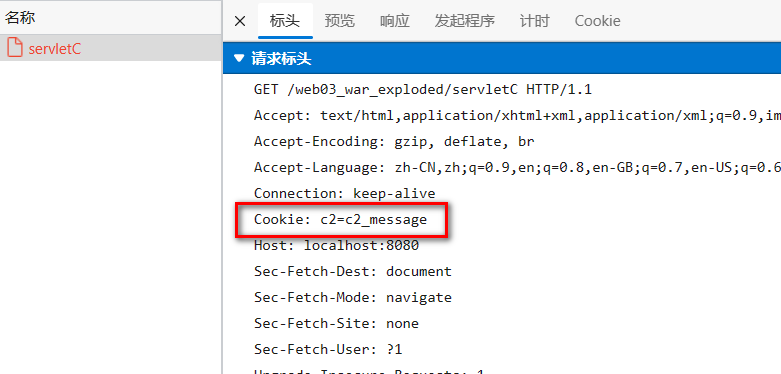
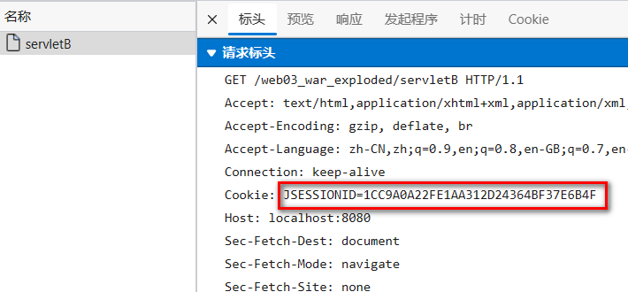
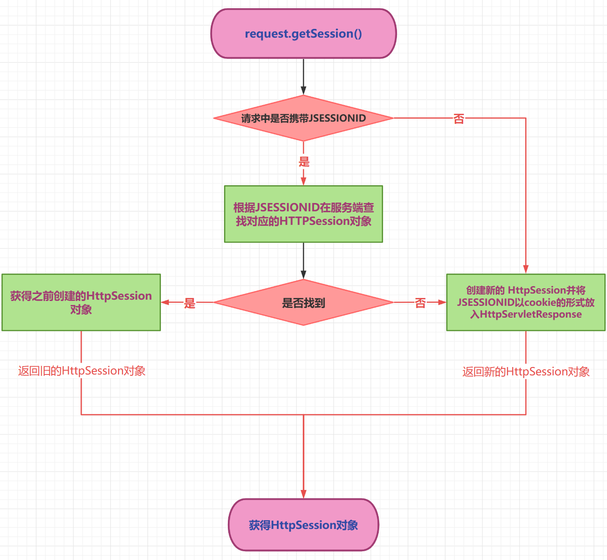
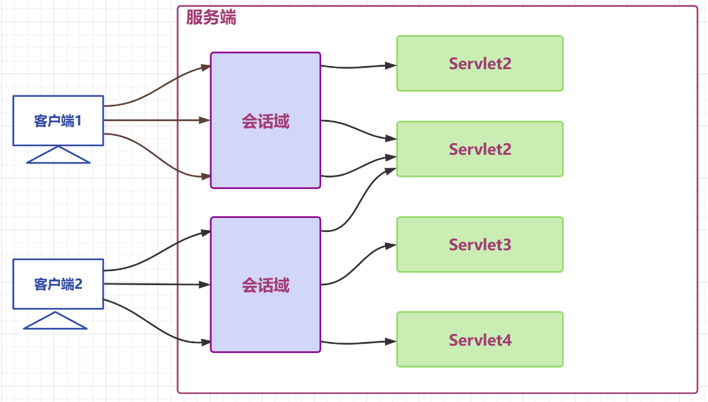

# javaweb

## js

- 基本说明：(前端三剑客之一，行为）

- 特点：解释型，基于对象的脚本语言，弱类型的（变量的数据类型在运行中可以变化）

- 使用方式：

  1.（可以在head和body里面使用，）引入js代码

  2.引入js文件：\<script src="./js(文件名)"></script>

  注意：两种方式二选一，不可以混用两种方式都使用不会报错，但是只有一个生效

```javascript
<script type="text/javascript">
 var name = "888";
alert("name=" + name);//弹窗显示
alert(typeof name);//输出变量的类型
console.log(name + "真的帅爆了");//在调试输出 F12调出控制台
</script>
```

- 查看js错误信息浏览器控制台 进入调试器 ctrl+shift+i

- js变量

  1.变量表示存储数据的容器

  2.var age=10; //定义方式，非常自由，弱

- 数据类型

  1.数据类型介绍数值类型：number字符串类型：string对象类型：object布尔类型：boolean函数类型：fuction(方法)

  2.特殊值！！undefined 变量未赋值null 空值NaN 非数值 Not a Number(比如100 * "hello")

  3.数据类型注意事项string 单引号双引号都可以

- 运算符关系运算符：= = =全等（值和类型都相等）

- 逻辑运算符：

  1. 所有变量都可以作为一个boolean使用
  1. 0,null,undefined,NaN,""(空串)都认为是false
  3. && 返回值遵循 短路与 机制表达式全为真时，返回最后一个表达式的值。表达式中有一个为假时，返回第一个假的表达式
  1. || 返回值遵循 短路或 机制表达式全为假时，返回最后一个表达式的值。只要有一个表达式为真，就会返回第一个为真的表达式

- 数组定义

   1. var a = ["zhezi","雨晴"]
   3. var a = new Array("zhezi","yuqing")//创建对象

```javascript
var a = [];//空数组
a[0] = "zhezi"//添加元素
var a = new Array();
a[0] = "zhezi";
a[1] = "yuqing";
```

- 数组遍历

   1. 数组长度 a.length;(log 方法自动换行)

- js函数快速入门

   1. 第一种方式直接调用
   2. 第二种方式，通过事件触发函数

```javascript
<script>
  //怎么执行？两种方式
  function hi() {
    alert("hi zhezi");
  }
hi();//主动调用的
</script>
<body>
<button onclick="hi()">
别点我</button>
<!--  //通过事件触发 -->
</body>
```

- js函数定义方式

   1. fuction关键字 方法
   2. 将函数赋值给变量

```js
<script>
 function hi() {
            alert("hi zhezi");
        }
    </script>
<script>
    //可以理解成hi指向了函数
  var hi = function () {
            alert("hi zhezi");
        }
    </script>
```

- js函数注意事项和细节

   1. js无函数重载，会直接覆盖
   2. 隐形参数，在function函数中不需要定义，可以直接用来获取所有参数的变量
   3. 如果函数中有形参，在传入实参的时候，仍然按照顺序匹配。匹配上的赋值给他。仍然把所有实参赋值给arguments。形参个数大于实参个数，该形参为undefined

```js
<script>
        function hi() {
            //隐形参数 arguments是数组
            //如果用console.log输出对象的数据用,连接
            console.log("arguments= ", arguments);
        }
        hi(20, 20, 30);
    </script>
```

- js自定义对象

1. object方式

```js
<script>
        //自定义对象的方式1  var 对象名 = new Object();
        var person = new Object();
        person.name = "zhezi";
        person.age = 20;
        person.say = function () {
            console.log(this.name+" "+this.age);
        }
        alert(person.name);//访问属性
        person.say();//访问方法
        //小细节，如果没有定义属性，直接使用，就会出现变量提升，显示undefined
    </script>
```

  2.{}方式

```js
//自定义对象的方式2 注意要有逗号分隔
var person = {
            name:"zhezi",
            age:20,
            say:function (){
                console.log(this.name+" "+this.age);
            }
        }
```

- js事件

1. onload 加载完成事件

   1）静态注册

```javascript
function sayok(){
  alert("静态注册");
}
<body onload="sayok()">
  </body>
```

​    2）动态注册 

 刷新后出现弹窗

2.onclick鼠标点击某个对象

 静态注册(略)

 动态注册 ：鼠标点击按钮出现弹窗 

```javascript
<script>
  //当页面加载完毕后，我们再进行动态注册可以使得在事件之前进行动态注册!!!!
  window.onload = function () {
    //动态注册 onclick 事件
    //1.先拿到 id=zhezi 的button 对应dom 对象
    //2.通过dom对象动态的绑定onclick事件
    //3，通过document 的 getElementById获取对应的dom对象
    var niubi = document.getElementById("zhezi");
    niubi.onclick = function () {
      alert("你点击了按钮");
    }
  }

  </script>
  </head>
  <body>
  <button id="zhezi">
  哲子点这里
  </button>
  </body>
```

3.onblur失去焦点事件（鼠标移开）

静态绑定:实现鼠标光标移开时，转化为大写的操作

```javascript
<title>onblur失去焦点事件</title>
  <script>
  //静态绑定
  function up() {
    //先得到zhezi 1 输入框的value->得到对应dom对象
    var zhezi1 = document.getElementById("zhezi1");
    zhezi1.value = zhezi1.value.toUpperCase();//转化为大写
  }
  </script>
  </head>
  <body>
  输入英文单词
  <input type="text" id="zhezi1" onblur="up()"><br>
```

 动态绑定

```javascript
//页面加载完毕，完成动态绑定
window.onload = function () {
  //得到zhezi2的dom对象
  var zhezi2 = document.getElementById("zhezi2");
  zhezi2.onblur = function (){
    zhezi2.value = zhezi2.value.toUpperCase();//转化为大写
  }

}
  <body>
  输入英文单词
  <input type="text" id="zhezi2"><br>
  </body>
```

4.onchange内容发生改变事件：比如下拉列表选择改变后出现弹窗，不改变则不出现弹窗

动态注册（静态注册略）

```javascript
<head>
  <meta charset="UTF-8">
  <title>onchange</title>
  <script>
  //动态注册
  window.onload = function () {
    //获取dom对象
    var niubi = document.getElementById("zhezi");
    //绑定onchange事件
    niubi.onchange = function () {
      alert("你换女友啦");
    }
  }
  </script>
  </head>
  <body>
  你当前的女友
  <select id="zhezi">
  <option>狄雨晴</option>
  <option>亲自梦</option>
  <option>迪丽热巴</option>
  </select>
  </body>
```

5. onsubmit表单提交事件

   1）静态表单提交

```java
<script>
//静态表单提交事件
function zhehh() {
    //先得到用户名和密码
    var zhe1 = document.getElementById("zhezi1");
    var zhe2 = document.getElementById("zhezi2");
    //判断是否为空
    if("" == zhe1.value || "" == zhe2.value){//细节1
        alert("用户名和密码不能为空");
        return false;//不提交
    }
    return true;
}
</script>
</head>
<body>
<h1>注册用户</h1>
<form action="ok.html" onsubmit="return zhehh()">//细节2：方法前要有return 才不会跳转，否则不输入密码出现弹窗，但仍然跳转到ok.html界面
u: <input type="text" id="zhezi1" name="username"/><br/>
p:<input type="password" id="zhezi2" name="psd"/><br/>
<input type="submit" value="注册用户"/>
</form>
</body>
```

2）动态表单提交正则表达式

## DOM

- DOM基本介绍：文档对象模型
- doucment 对象 (一种树结构的文档)

   1. dom对象.innerText//获取文本
   2. dom对象.iinnerHTML//获取所有东西
   3. 获取复选框用getElementsByName,dom对象是集合，需要遍历
   4. 通过点击按钮更改图片，获取dom对象 用getElementByTagName,dom对象[i].src=""
   5. 创建一只伍六七案例

```javascript
<!DOCTYPE html>
  <html lang="en">
  <head>
  <meta charset="UTF-8">
  <title>创建小猫案例</title>
  <script>
  function addimg() {
    //1,拿到对象
    var zhe = document.createElement("img");//里面你想添加什么类型就写什么类型，html,img等等
    zhe.src = "wallhaven-p9op59.jpg";
    zhe.width = "100";
    //展示,添加到document.body，总不能在外面展示吧，需要到body里面展示
    document.body.appendChild(zhe);
  }
  </script>
  </head>
  <body>
  <input type="button" onclick="addimg()" value="创建一只伍六七">
  </body>
  </html>
```

​    dom编程核心：拿到+操作，属性和方法查文档

- a.节点常用的方法
- b. 节点常用属性

1. id-->getElementById()

   2. name-->getElementsByname()

   3. 元素标签名-->

   4. 获取指定dom对象下的子节点

      1）获取某个节点var zhe = document.getElementById("zhezi").getElement.getElementsByTagName("li");//获取id为zhezi下面的所有li元素

      2）获取指定dom对象下的所有节点

```javascript
var zhe = document.getElementById("zhezi").chileNodes;
for(var i = 0; i < zhe.length;i++)//遍历
```

​    3）本身就有集合的特点获取的是object text 和object html(如果不希望得到text对象，需要将所有的内容放在一行)

​    4）获取第一个节点

​    5)获取父节点zhe.parentNode

​    6)获取兄弟节点

​    前一个节点: zhe.previousSibling 

​    后一个节点：zhe.nextSibling

css小复习：postion:abslote 绝对定位 针对原点定位 left距离窗口原点的横坐标 top距离窗口原点的纵坐标 

## XML

### 1.xml基本介绍

- 可扩展标记语言
- 两个程序间进行数据通信 
- 给一台服务器做一个配置文件
- spring 中的ico配置文件，beans.xml ,mybatis XXXMapper.xml ,tomat server.xml,web.xml,maven pom.xml
- 能存储一些复杂的数据关系

### 2.xml快速入门

```javascript
<!--1.xml:该文件的类型是xml 
2.version="1.0"版本 
3.encoding="UTF-8" 文件的编码
4.students :根元素，程序员自己定
5.<student></student> 表示students一个元素，可以有多个
6.id是属性，name,age,gender是student元素的子元素
-->
  <?xml version="1.0" encoding="UTF-8" ?>
  <students>
  <stdent id="100">
  <name>zhezi</name>
  <age>19</age>
  <gender>男</gender>
  </stdent>
  </students>
```

### 3.xml语法

- 文档声明放在第一行

- 每个文档有且只有一个根元素

- 不含标签体简写为\<zhe/>

- 命名规则（标签）

   1. 标签区分大小写
   2. 标签不能以数字开头
   3. 标签不能包含空格
   4. 标签不能包含：（冒号）

- 属性:

   1)一个元素可以有多个属性

   2)特定的属性名称在同一个元素标记中只能出现一次

   3)属性的值里面不能包括&字符

- CDATA节

    1.说明：有些内容不想让解析引擎执行，而是当作原始内容处理（即当做普通文本）
   
    2.语法：
   
     1)可以输入任意字符（除 ]]>）
   
     2)不能嵌套

```javascript
<![CDATA[
   这里面就会被当成纯文本处理
   ]]>
```

- 转义字符

  转义字符对于一些单个字符，若想显示其原始样式，也可以使用转义的形式进行处理

### 4.DOM4j

- DOM4j介绍1.需要下载2.获取document对象的方式读取xml文件，获得document对象
- 加载xml文件1.导入dom4j.jar包费了老大劲了，去B站找视频解决的，步骤：【jdbc-U2-day18-idea里面导入jar包】https://www.bilibili.com/video/BV1d341177YU?vd_source=5d84cc9e024d434b43eb1315843600052.加载xml文件

```javascript
import org.junit.jupiter.api.Test;
import org.dom4j.Document;
import org.dom4j.DocumentException;
import org.dom4j.io.SAXReader;
import java.io.File;
public class dom4j {
  //如何加载xml文件
  @Test//引入Junit5
  public void LoadXML() throws DocumentException {
  //得到一个解析器
  SAXReader reader = new SAXReader();
  Document document = reader.read(new File("src/students.xml"));
  System.out.println(document);
}
}
```

- 遍历xml指定元素看到第11集，等泛型看完继续看吧，泛型还没学有点跟不上了

## vue  

### 踩坑

1）算是未做项目以来踩了第一个大坑，原因是vscode 引入element ui没有自动导入，我一直以为是插件的问题，删了又下，过了一天才发现并不是，原来是App.vue这个默认文件script里面没有加export default这个语句，导致它引入的地方不对，导致报错

这部分暂时先不看


## Maven

### 初识Maven

#### 什么是Maven

Maven是Apache旗下的一个开源项目，是一款用于管理和构建java项目的工具。

#### Maven的作用

1）依赖管理

方便快捷的管理项目依赖的资源(jar包)，避免版本冲突问题

2）统一项目结构

提供标准、统一的项目结构


3）项目构建

maven提供了标准的、跨平台(Linux、Windows、MacOS) 的自动化项目构建方式

### Maven概述

#### Maven仓库

- 本地仓库：自己计算机上的一个目录(用来存储jar包)，我的仓库地址：D:\apache-maven-3.8.8\mvn_repo

- 中央仓库：由Maven团队维护的全球唯一的。仓库地址：https://repo1.maven.org/maven 

- 远程仓库(私服)：一般由公司团队搭建的私有仓库，这里附上阿里云私服地址：

  ```xml
  <mirror>  
  	<id>alimaven</id>  
  	<name>aliyun maven</name>  
  	<url>http://maven.aliyun.com/nexus/content/groups/public/</url>
  	<mirrorOf>central</mirrorOf>          
  </mirror>
  ```

  jar包查找顺序:本地仓库-->远程仓库（私服）--> 中央仓库
####  Maven安装

##### 下载

注意：jdk17与Maven3.6.1不适配，==安装时会报错==

可用jdk11 与 Maven3.6.1

或jdk17 与 Maven 3.8.8

附上Maven下载地址：https://maven.apache.org/download.cgi

##### 安装

1）解压安装

2）配置本地仓库

就是新建文件夹，附上我的本地仓库地址 D:\apache-maven-3.8.8\mvn_repo

3）配置阿里云私服

由于中央仓库在国外，所以下载jar包速度可能比较慢，而阿里公司提供了一个远程仓库，里面基本也都有开源项目的jar包。 

进入到conf目录下修改settings.xml配置文件：

 1). 使用ideae，打开settings.xml文件，定位到160行左右

 2). 在\<mirrors>标签下为其添加子标签(子标签在上面的阿里云私服地址)

4）配置环境变量

1). 在系统变量处新建一个变量MAVEN_HOME 

MAVEN_HOME环境变量的值，设置为maven的解压安装目录 D:\apache-maven-3.8.8

2). 在Path中进行配置 

PATH环境变量的值，设置为：%MAVEN_HOME%\bin

3）打开cmd验证，输入mvn -v出现版本号即为成功

### idea集成Maven

#### 自用版本号

idea版本2023专业版

jdk17

Maven3.8.8

#### 配置Maven环境 全局设置

1、进入到IDEA欢迎页面 

选择 IDEA中 File => close project

2、点击Customize,打开 All settings , 选择 Build,Execution,Deployment => Build Tools =>  Maven


3)配置工程的编译版本17，选17（选与自己jdk版本相同的）


#### 创建Maven项目

（适用于idea2023专业版）

1）左上角fiel -> new -> Module...

2)按图中勾选即可成功创建 


#### 在Maven项目中输出Hello Maven

##### Maven项目的目录结构: 

maven-project01 

  |--- src (源代码目录和测试代码目录)

​    |- -- main (源代码目录) 

​       |--- java (源代码java文件目录) 

​       |--- resources (源代码配置文件目录) 

​    |--- test (测试代码目录) 

​       |--- java (测试代码java目录) 

​       |--- resources (测试代码配置文件目录) 

   |--- target (编译、打包生成文件存放目录)

##### 运行hello maven时出现的问题

###### 问题一

maven报错：不支持发行版本5

解决方案：file->project structure 这两个地方改成与jdk版本一致


###### 问题二

 maven报错：不再支持源选项 5。请使用 7 或更高版本。

 解决方案（永久性解决）：在settings.xml文件中找到标签\<profiles>，在里面新建一个字标签\<profile> 在里面添加jdk版本说明。根据自己的jdk版本进行相应修改。

```xml
<profile>  
     <id>jdk-17</id>  
     <activation>  
         <activeByDefault>true</activeByDefault>  
         <jdk>17</jdk>  
     </activation>
     <properties>
         <project.build.sourceEncoding>UTF-8</project.build.sourceEncoding>
         <maven.compiler.source>17</maven.compiler.source>  
         <maven.compiler.target>17</maven.compiler.target>   
     </properties>   
</profile>
```


### 依赖管理

#### 依赖配置

##### 什么是依赖

依赖：指当前项目运行所需要的jar包。一个项目中可以引入多个依赖

##### 依赖配置步骤

1. 在pom.xml中编写标签 \<dependencies> \<dependency>
2. 在标签中使用引入坐标 
3. 定义坐标的 groupId、artifactId、version
4. 刷新

#### 依赖传递

##### 依赖具有传递性

##### 依赖传递分为

a.直接依赖：在当前项目中通过依赖配置建立的依赖关系

b.间接依赖：被依赖的资源如果依赖其他资源，当前项目间接依赖其他资源

##### 排除依赖

问题：之前我们讲了依赖具有传递性。那么A依赖B，B依赖C，如果A不想将C依赖进来，是否可以做到？ 

答案：在maven项目中，我们可以通过排除依赖来实现

排除依赖：指主动断开依赖的资源。（被排除的资源无需指定版本）,使用:\<exclusions>标签排除依赖

#### 依赖范围

##### 依赖范围设置标签

\<scope>

##### 标签取值范围


#### 生命周期

##### 介绍

Maven的生命周期就是为了对所有的构建过程进行抽象和统一。 描述了一次项目构建，经历哪些阶段。

##### 阶段

主要关注以下生命周期

• clean：移除上一次构建生成的文件 

• compile：编译项目源代码

• test：使用合适的单元测试框架运行测试(junit) 

• package：将编译后的文件打包，如：jar、war等 

• install：安装项目到本地仓库

##### 说明

在同一套生命周期中，我们在执行后面的生命周期时，前面的生命周期都会执行。

##### 执行

方式一:在idea工具右侧的maven工具栏中，选择对应的生命周期(Lifecycle)，双击执行

方式二:在命令行中执行生命周期

1)进入到DOS命令行


2) mvn + 生命周期,回车执行

## SpringBoot基础

SpringBoot特点：简化配置，快速开发

### SpringBootWeb入门

#### 需求

基于SpringBoot的方式开发一个web应用，浏览器发起请求/hello后，给浏览器返回字符串 “Hello World ~”。

#### 开发步骤

##### 创建SpringBoot工程

1）创建SpringBoot工程


2）勾选web开发相关依赖。


#### 定义请求处理类

在com.itheima这个包下创建一个子包controller

然后在controller包下新建一个类：HelloController

在该类中输入如下代码

```java
package com.itheima.controller;
import org.springframework.web.bind.annotation.*;
@RestController//声明该类是一个控制器，并且其方法的返回值将直接作为HTTP响应体
public class HelloController {
@RequestMapping("/hello") // 声明该方法用于处理URL路径为"/hello"的HTTP请求
public String hello(){// 定义一个名为"hello"的方法
System.out.println("Hello World ~");// 在控制台打印"Hello World ~"消息
return "Hello World ~";// 返回字符串"Hello World ~"作为HTTP响应体
 }
} 
```

#### 运行测试

运行SpringBoot自动生成的引导类main-java下的启动类--ApplicationTests

在控制台会打印端口号，在浏览器输入 http://localhost:8080/hello,则会跳转到对应页面，页面出现Hello World ~

#### web分析


网络三要素

1）ip：网络中计算机的唯一标识

2）端口：计算机中运行程序的唯一标识

3）协议：网络中计算机之间交互的规则

浏览器和服务器两端进行数据交互，使用什么http协议

### HTTP协议

#### 介绍

HTTP：Hyper Text Transfer Protocol(超文本传输协议)，规定了浏览器与服务器之间数据传输的规则。

- http是互联网上应用最为广泛的一种网络协议 
- http协议要求：浏览器在向服务器发送请求数据时，或是服务器在向浏览器发送响应数据时，都必须按照固定的格式进行数据传输
- 分为请求协议和响应协议

#### 特点

- 基于TCP协议：TCP是一种面向连接的(建立连接之前是需要经过三次握手)、可靠的、基于字节流的传输层通信协议，在数据传输方面更安全
- 基于请求-响应模型:一次请求对应一次响应（先请求后响应）
- HTTP协议是无状态协议: 对于数据没有记忆能力。每次请求-响应都是独立的

#### HTTP-请求协议

##### 概述

浏览器将数据以请求格式发送到服务器

包括：请求行，请求头，请求体

##### 方式1 GET


- 请求行：HTTP请求中的第一行数据。由：请求方式 、资源路径 、协议/版本组成（之间使用空格分隔）

  1）资源路径又分为请求路径和请求参数

  2）请求路径和请求参数之间使用 ? 连接

  3）多个多个请求参数之间使用 & 连接

- 请求头： 第二行开始，上图黄色部分内容就是请求头。格式为key: value形式

  http是个无状态的协议，所以在请求头设置浏览器的一些自身信息和想要响应的形式。这样服务器在收到信息后，就可以知道是谁，想干什么了

- 请求体：存储请求参数

  GET请求参数在请求行中，故没有请求体

##### 方式2 POST


##### 二者区别


#### HTTP响应协议

##### 概述

服务器将数据以响应格式返回给浏览器

包括：响应行，响应头，响应体


##### 响应状态码


需要认识的状态码

- 200 ok 客户端请求成功 
- 404 Not Found 请求资源不存在 
- 500 Internal Server Error 服务端发生不可预期的错误

### web服务器-tomcat

#### 服务器概述


#### web服务器

Web服务器是一个应用程序(软件)，对HTTP协议的操作进行封装，使得程序员不必直接对协议进行操作 (不用程序员自己写代码去解析http协议规则)，让Web开发更加便捷。主要功能是"提供网上信息浏览服务"。


Web服务器是安装在服务器端的一款软件，将来我们把自己写的Web项目部署到Tomcat服务器软件中， 当Web服务器软件启动后，部署在Web服务器软件中的页面就可以直接通过浏览器来访问了

#### Tomcat

##### 下载与安装

官网下载：[Apache Tomcat® - Apache Tomcat 9 Software Downloads](https://tomcat.apache.org/download-90.cgi)

目录文件


##### 启动与关闭

###### 启动

双击tomcat解压目录/bin/startup.bat文件即可启动tomcat

注意事项 ：Tomcat启动的过程中，遇到控制台有中文乱码时，可以通常修改 conf/logging.prooperties文件解决


###### 关闭

1、强制关闭：直接x掉Tomcat窗口（不建议）

2、正常关闭：bin\shutdown.bat

3、正常关闭：在Tomcat启动窗口中按下 Ctrl+C

###### 更改端口号

修改 conf/server.xml文件


##### SpringBoot入门解析

###### Spring官方骨架

我们可以通过访问：https://start.spring.io/ ，进入到官方骨架页面

###### 内嵌Tomcat

在我们的idea创建的SpringBoot中，引入了web运行环境(也就是引入spring-boot-starterweb起步依赖)，其内部已经集成了内置的Tomcat服务器

## 请求响应

### 请求

#### Postman

- Postman是一款功能强大的网页调试与发送网页HTTP请求的Chrome插件
- 作用：常用于接口测试

注意：下面这部分参数的代码都是在Controller中所写的

#### 简单参数

简单参数：在向服务器发起请求时，向服务器传递的是一些普通的请求数据。

后端服务器接收传递过来的简单参数数据

##### 接收方式

###### 方式一 原始方式(了解即可开发不会使用)

```java
@RestController
public class RequestController {
@RequestMapping("/simpleParam")
public String simpleParam(HttpServletRequest request){
// http://localhost:8080/simpleParam?name=Tom&age=10
// 请求参数： name=Tom&age=10 （有2个请求参数）
// 第1个请求参数： name=Tom 参数名:name，参数值:Tom
// 第2个请求参数： age=10 参数名:age , 参数值:10
String name = request.getParameter("name");//name就是请求参数名
String ageStr = request.getParameter("age");//age就是请求参数
名
int age = Integer.parseInt(ageStr);//需要手动进行类型转换
System.out.println(name+" : "+age);
return "OK";
 }
```


###### 方式二 springboot方式

形参名与请求参数名相同

```java
@RestController
public class RequestController {
// http://localhost:8080/simpleParam?name=Tom&age=10
// 第1个请求参数： name=Tom 参数名:name，参数值:Tom
// 第2个请求参数： age=10 参数名:age , 参数值:10
//springboot方式
@RequestMapping("/simpleParam")
public String simpleParam(String name , Integer age ){//形参名和
请求参数名保持一致！！！！！！
System.out.println(name+" : "+age);
return "OK";
 }
}

```

形参名与请求参数名不同

 解决：使用Spring提供的@RequestParam注解完成映射 意思是从HTTP请求中获取名为 "name" 的参数，并将其映射到方法的 `String` 类型参数 `username` 上，required = false 表示参数是可选的，如果请求中没有名为 "name" 的参数，不会抛出异常，而是将 `username` 参数设为 `null`。默认required = true 如果请求中没有名为 "name" 的参数，会抛出异常。

```java
@RequestMapping("/simpleParam")
public String simpleParam(@RequestParam(name = "name", required =
false) String username, Integer age){ 
System.out.println(username+ ":" + age);
return "OK";
}
```

#### 实体参数

参数为实体类 User user

请求参数名要与实体类属性名一致，不一致为null

#### 数组集合参数

##### 数组参数

Controller方法

```java
@RestController
public class RequestController {
//数组参数
@RequestMapping("/arrayParam")
public String arrayParam(String[] hobby){
System.out.println(Arrays.toString(hobby));//把数组转化为字符串[game,java]
return "OK";
 }
}
```

Postman请求

方式一：hobby=game&hobby=java

方式二：hobby=game,java

##### 集合参数

Controller方法

```java
@RestController
public class RequestController {
//集合参数
@RequestMapping("/listParam")
public String listParam(@RequestParam List<String> hobby){//将请求参数的值绑定到集合hobby上
System.out.println(hobby);
return "OK";
 }
}
```

#### 日期参数

Controller方法

```java
@RestController
public class RequestController {
//日期时间参数
@RequestMapping("/dateParam")
public String dateParam(@DateTimeFormat(pattern = "yyyy-MM-dd
HH:mm:ss") LocalDateTime updateTime){ //@DateTimeFormat注解的pattern属性中指定了哪种日期格式，前端的日期参数就必须按照指定
//的格式传递。需要使用Date类型或LocalDateTime类型，来封装传递的参数。
System.out.println(updateTime);
return "OK";
 }
}
```

#### JSON参数

Postman发送JSON格式数据：


Controller方法接收参数

@RequestBody注解：将JSON数据映射到形参的实体类对象中（JSON中的key和实体类中的属性名保持一致）

```java
@RestController
public class RequestController {
//JSON参数
@RequestMapping("/jsonParam")
public String jsonParam(@RequestBody User user){
System.out.println(user);
return "OK";
 }
}

```

#### 路径参数

传统的开发中请求参数是放在请求体(POST请求)传递或跟在URL后面通过?key=value的形式传递 (GET请求)。

路径参数：直接在请求的URL中传递参数,比如：http://localhost:8080/user/1 

后端如何接收路径参数

```Java
//传递多个路径参数
@RestController
public class RequestController {
//路径参数
@RequestMapping("/path/{id}/{name}")//因为前端请求的路径参数是可变的，所以后端在收到数据时，使用{key}方式来标记路径参数
public String pathParam2(@PathVariable Integer id, @PathVariable
String name){//@PathVariable 注解：获取路径参数{id},把路径参数绑定到形参变量id
System.out.println(id+ " : " +name);
return "OK";
 }
}
```


#### 出现的小问题


### 响应

类加载器---动态代理部分有讲，，反射，，xmldom4j解析基础

### 分层解耦

## Servlet


##  会话管理概述

###  为什么需要会话管理

> HTTP是无状态协议

+ 无状态就是不保存状态,即无状态协议(stateless),HTTP协议自身不对请求和响应之间的通信状态进行保存,也就是说,在HTTP协议这个级别,协议对于发送过的请求或者响应都不做持久化处理
+ 简单理解:浏览器发送请求,服务器接收并响应,但是服务器不记录请求是否来自哪个浏览器,服务器没记录浏览器的特征,就是客户端的状态

> 举例: 张三去一家饭馆点了几道菜,觉得味道不错,第二天又去了,对老板说,还点上次的那几道菜

+ 无状态: 老板没有记录张三是否来过,更没有记录上次他点了那些菜,张三只能重新再点一遍
+ 有状态: 老板把每次来吃饭的用户都做好记录,查阅一下之前的记录,查到了张三之前的菜单,直接下单

### 会话管理实现的手段

> Cookie和Session配合解决

+ cookie是在==客户端==保留少量数据的技术,主要通过响应头向客户端响应一些客户端要保留的信息
+ session是在==服务端==保留更多数据的技术,主要通过HttpSession对象保存一些和客户端相关的信息
+ cookie和session配合记录请求状态

> 举例: 张三去银行办业务

+ 张三第一次去某个银行办业务,银行会为张三开户(Session),并向张三发放一张银行卡(cookie)
+ 张三后面每次去银行,就可以携带之间的银行卡(cookie),银行根据银行卡找到之前张三的账户(session)

##  Cookie

###  Cookie概述

> cookie是一种客户端会话技术,cookie由服务端产生,它是服务器存放在浏览器的一小份数据,浏览器以后每次访问该服务器的时候都会将这小份数据携带到服务器去。

+ 服务端创建cookie,将cookie放入响应对象中,Tomcat容器将cookie转化为set-cookie响应头,响应给客户端
+ 客户端在收到cookie的响应头时,在下次请求该服务的资源时,会以cookie请求头的形式携带之前收到的Cookie
+ cookie是一种==键值对==格式的数据,从tomcat8.5开始可以保存中文,但是不推荐
+ 由于cookie是存储于客户端的数据,比较容易暴露,一般不存储一些敏感或者影响安全的数据

> 原理图


> 应用场景举例

1. 记录用户名

   当我们在用户名的输入框中输入完用户名后,浏览器记录用户名,下一次再访问登录页面时,用户名自动填充到用户名的输入框.

2. 保存电影播放进度

   在网页上播放电影的时候,如果中途退出浏览器了,下载再打开浏览器播放同一部电影的时候,会自动跳转到上次退出时候的进度,因为在播放的时候会将播放进度保存到cookie中


###  Cookie的使用

> servletA向响应中增加Cookie

``` java
@WebServlet("/servletA")
public class ServletA extends HttpServlet {
    @Override
    protected void service(HttpServletRequest req, HttpServletResponse resp) throws ServletException, IOException {
        // 创建Cookie
        Cookie cookie1 =new Cookie("c1","c1_message");
        Cookie cookie2 =new Cookie("c2","c2_message");
        // 将cookie放入响应对象
        resp.addCookie(cookie1);
        resp.addCookie(cookie2);
    }
}
```


> servletB从请求中读取Cookie

``` java
@WebServlet("/servletB")
public class ServletB extends HttpServlet {
    @Override
    protected void service(HttpServletRequest req, HttpServletResponse resp) throws ServletException, IOException {
        //获取请求中的cookie
        Cookie[] cookies = req.getCookies();
        //迭代cookies数组
        if (null != cookies && cookies.length!= 0) {
            for (Cookie cookie : cookies) {
                System.out.println(cookie.getName()+":"+cookie.getValue());
            }
        }
    }
}
```


###   Cookie的时效性

> 默认情况下Cookie的有效期是一次会话范围内，我们可以通过cookie的setMaxAge()方法让Cookie持久化保存到浏览器上

-   会话级Cookie
    -   服务器端并没有明确指定Cookie的存在时间
    -   在浏览器端，Cookie数据存在于内存中
    -   只要浏览器还开着，Cookie数据就一直都在
    -   浏览器关闭，内存中的Cookie数据就会被释放
-   持久化Cookie
    -   服务器端明确设置了Cookie的存在时间
    -   在浏览器端，Cookie数据会被保存到硬盘上
    -   Cookie在硬盘上存在的时间根据服务器端限定的时间来管控，不受浏览器关闭的影响
    -   持久化Cookie到达了预设的时间会被释放

> cookie.setMaxAge(int expiry)参数单位是秒，表示cookie的持久化时间，如果设置参数为0，表示将浏览器中保存的该cookie删除

+ servletA设置一个Cookie为持久化cookie

``` java
@WebServlet("/servletA")
public class ServletA extends HttpServlet {
    @Override
    protected void service(HttpServletRequest req, HttpServletResponse resp) throws ServletException, IOException {
        // 创建Cookie
        Cookie cookie1 =new Cookie("c1","c1_message");
        cookie1.setMaxAge(60);
        Cookie cookie2 =new Cookie("c2","c2_message");
        // 将cookie放入响应对象
        resp.addCookie(cookie1);
        resp.addCookie(cookie2);
    }
}
```


+ servletB接收Cookie,浏览器中间发生一次重启再请求servletB测试

``` java
@WebServlet("/servletB")
public class ServletB extends HttpServlet {
    @Override
    protected void service(HttpServletRequest req, HttpServletResponse resp) throws ServletException, IOException {
        //获取请求中的cookie
        Cookie[] cookies = req.getCookies();
        //迭代cookies数组
        if (null != cookies && cookies.length!= 0) {
            for (Cookie cookie : cookies) {
                System.out.println(cookie.getName()+":"+cookie.getValue());
            }
        }
    }
}
```


###  Cookie的提交路径

> 访问互联网资源时不能每次都需要把所有Cookie带上。访问不同的资源时,可以携带不同的cookie,我们可以通过cookie的setPath(String path) 对cookie的路径进行设置

+ 从ServletA中获取cookie

``` java
public class ServletA extends HttpServlet {
    @Override
    protected void service(HttpServletRequest req, HttpServletResponse resp) throws ServletException, IOException {
        // 创建Cookie
        Cookie cookie1 =new Cookie("c1","c1_message");
        // 设置cookie的提交路径
        cookie1.setPath("/web03_war_exploded/servletB");
        Cookie cookie2 =new Cookie("c2","c2_message");
        // 将cookie放入响应对象
        resp.addCookie(cookie1);
        resp.addCookie(cookie2);
    }
}

```


+ 向ServletB请求时携带携带了 c1


+ 向其他资源请求时就不携带c1了




## Session

###  HttpSession概述

>  HttpSession是一种保留更多信息在服务端的一种技术,服务器会为每一个客户端开辟一块内存空间,即session对象. 客户端在发送请求时,都可以使用自己的session. 这样服务端就可以通过session来记录某个客户端的状态了

+ 服务端在为客户端创建session时,会同时将session对象的id,即JSESSIONID以cookie的形式放入响应对象
+ 后端创建完session后,客户端会收到一个特殊的cookie,叫做JSESSIONID
+ 客户端下一次请求时携带JSESSIONID,后端收到后,根据JSESSIONID找到对应的session对象
+ 通过该机制,服务端通过session就可以存储一些专门针对某个客户端的信息了
+ session也是域对象(后续详细讲解)

> 原理图如下


> 应用场景

1. 记录用户的登录状态

   用户登录后,将用户的账号等敏感信息存入session

2. 记录用户操作的历史

   例如记录用户的访问痕迹,用户的购物车信息等临时性的信息

###  HttpSession的使用

> 用户提交form表单到ServletA,携带用户名,ServletA获取session 将用户名存到Session,用户再请求其他任意Servlet,获取之间存储的用户

+ 定义表单页,提交用户名,提交后

``` html
    <form action="servletA" method="post">
        用户名:
        <input type="text" name="username">
        <input type="submit" value="提交">
    </form>
```

+ 定义ServletA,将用户名存入session

``` java
@WebServlet("/servletA")
public class ServletA extends HttpServlet {
    @Override
    protected void service(HttpServletRequest req, HttpServletResponse resp) throws ServletException, IOException {
        // 获取请求中的参数
        String username = req.getParameter("username");
        // 获取session对象
        HttpSession session = req.getSession();
         // 获取Session的ID
        String jSessionId = session.getId();
        System.out.println(jSessionId);
        // 判断session是不是新创建的session
        boolean isNew = session.isNew();
        System.out.println(isNew);
        // 向session对象中存入数据
        session.setAttribute("username",username);

    }
}
```

+ 响应中收到了一个JSESSIONID的cookie


+ 定义其他Servlet,从session中读取用户名

``` java
@WebServlet("/servletB")
public class ServletB extends HttpServlet {
    @Override
    protected void service(HttpServletRequest req, HttpServletResponse resp) throws ServletException, IOException {
        // 获取session对象
        HttpSession session = req.getSession();
         // 获取Session的ID
        String jSessionId = session.getId();
        System.out.println(jSessionId);
        // 判断session是不是新创建的session
        boolean isNew = session.isNew();
        System.out.println(isNew);
        // 从session中取出数据
        String username = (String)session.getAttribute("username");
        System.out.println(username);
    }
}
```

+ 请求中携带了一个JSESSIONID的cookie



> getSession方法的处理逻辑




###  HttpSession时效性

> 为什么要设置session的时效

+ 用户量很大之后，Session对象相应的也要创建很多。如果一味创建不释放，那么服务器端的内存迟早要被耗尽。
+ 客户端关闭行为无法被服务端直接侦测,或者客户端较长时间不操作也经常出现,类似这些的情况,就需要对session的时限进行设置了

> 默认的session最大闲置时间(两次使用同一个session中的间隔时间) 在tomcat/conf/web.xml配置为30分钟


> 我们可以自己在当前项目的web.xml对最大闲置时间进行重新设定


> 也可以通过HttpSession的API 对最大闲置时间进行设定

``` java
// 设置最大闲置时间
session.setMaxInactiveInterval(60);
```

> 也可以直接让session失效

``` java
// 直接让session失效
session.invalidate();
```

##  三大域对象

###  域对象概述

> 域对象: 一些用于存储数据和传递数据的对象,传递数据不同的范围,我们称之为不同的域,不同的域对象代表不同的域,共享数据的范围也不同

+ web项目中,我们一定要熟练使用的域对象分别是 请求域,会话域,应用域
+ 请求域对象是HttpServletRequest ,传递数据的范围是一次请求之内及请求转发
+ 会话域对象是HttpSession,传递数据的范围是一次会话之内,可以跨多个请求
+ 应用域对象是ServletContext,传递数据的范围是本应用之内,可以跨多个会话

> 生活举例: 热水器摆放位置不同,使用的范围就不同

1. 摆在张三工位下,就只有张三一个人能用
2. 摆在办公室的公共区,办公室内的所有人都可以用
3. 摆在楼层的走廊区,该楼层的所有人都可以用

> 三大域对象的数据作用范围图解

+ 请求域


+ 会话域



+ 应用域


+ 所有域在一起


###  域对象的使用

> 域对象的API

| API                                         | 功能                    |
| ------------------------------------------- | ----------------------- |
| void setAttribute(String name,String value) | 向域对象中添加/修改数据 |
| Object getAttribute(String name);           | 从域对象中获取数据      |
| removeAttribute(String name);               | 移除域对象中的数据      |

> API测试

+ ServletA向三大域中放入数据

``` java
@WebServlet("/servletA")
public class ServletA extends HttpServlet {
    @Override
    protected void service(HttpServletRequest req, HttpServletResponse resp) throws ServletException, IOException {
        // 向请求域中放入数据
        req.setAttribute("request","request-message");
        //req.getRequestDispatcher("servletB").forward(req,resp);
        // 向会话域中放入数据
        HttpSession session = req.getSession();
        session.setAttribute("session","session-message");
        // 向应用域中放入数据
        ServletContext application = getServletContext();
        application.setAttribute("application","application-message");

    }
}

```

+ ServletB从三大于中取出数据

``` java
@WebServlet("/servletB")
public class ServletB extends HttpServlet {
    @Override
    protected void service(HttpServletRequest req, HttpServletResponse resp) throws ServletException, IOException {
        // 从请求域中获取数据
        String reqMessage =(String)req.getAttribute("request");
        System.out.println(reqMessage);
        
        // 从会话域中获取数据
        HttpSession session = req.getSession();
        String sessionMessage =(String)session.getAttribute("session");
        System.out.println(sessionMessage);
        // 从应用域中获取数据
        ServletContext application = getServletContext();
        String applicationMessage =(String)application.getAttribute("application");
        System.out.println(applicationMessage);
    }
}
```


+ 请求转发时,请求域可以传递数据`请求域内一般放本次请求业务有关的数据,如:查询到的所有的部门信息`
+ 同一个会话内,不用请求转发,会话域可以传递数据`会话域内一般放本次会话的客户端有关的数据,如:当前客户端登录的用户` 
+ 同一个APP内,不同的客户端,应用域可以传递数据`应用域内一般放本程序应用有关的数据 如:Spring框架的IOC容器`

##  监听器概述

> 监听器：专门用于对==域对象==对象身上发生的事件或状态改变进行监听和相应处理的对象

+ 监听器是GOF设计模式中,观察者模式的典型案例
+ 观察者模式: 当被观察的对象发生某些改变时, 观察者自动采取对应的行动的一种设计模式

+ 监听器使用的感受类似JS中的事件,被观察的对象发生某些情况时,自动触发代码的执行
+ 监听器并不监听web项目中的所有组件,仅仅是对三大域对象做相关的事件监听

> 监听器的分类

+ web中定义八个监听器接口作为监听器的规范,这八个接口按照不同的标准可以形成不同的分类

+ 按监听的对象划分
  + application域监听器 ServletContextListener  ServletContextAttributeListener 
  + session域监听器 HttpSessionListener  HttpSessionAttributeListener  HttpSessionBindingListener  HttpSessionActivationListener  
  + request域监听器 ServletRequestListener  ServletRequestAttributeListener 
+ 按监听的事件分
  + 域对象的创建和销毁监听器 ServletContextListener   HttpSessionListener   ServletRequestListener  
  + 域对象数据增删改事件监听器 ServletContextAttributeListener  HttpSessionAttributeListener   ServletRequestAttributeListener 
  + 其他监听器  HttpSessionBindingListener  HttpSessionActivationListener  

## 监听器的六个主要接口

### application域监听器

> ServletContextListener  监听ServletContext对象的==创建与销毁==

| 方法名                                      | 作用                     |
| ------------------------------------------- | ------------------------ |
| contextInitialized(ServletContextEvent sce) | ServletContext创建时调用 |
| contextDestroyed(ServletContextEvent sce)   | ServletContext销毁时调用 |

+ ServletContextEvent对象代表从ServletContext对象身上捕获到的事件，通过这个事件对象我们可以获取到ServletContext对象。

> ServletContextAttributeListener 监听ServletContext中属性的添加、移除和修改

| 方法名                                               | 作用                                 |
| ---------------------------------------------------- | ------------------------------------ |
| attributeAdded(ServletContextAttributeEvent scab)    | 向ServletContext中添加属性时调用     |
| attributeRemoved(ServletContextAttributeEvent scab)  | 从ServletContext中移除属性时调用     |
| attributeReplaced(ServletContextAttributeEvent scab) | 当ServletContext中的属性被修改时调用 |

+ ServletContextAttributeEvent对象代表属性变化事件，它包含的方法如下：

| 方法名              | 作用                     |
| ------------------- | ------------------------ |
| getName()           | 获取修改或添加的属性名   |
| getValue()          | 获取被修改或添加的属性值 |
| getServletContext() | 获取ServletContext对象   |

> 测试代码

+ 定义监听器

``` java
package com.atguigu.listeners;

import jakarta.servlet.*;
import jakarta.servlet.annotation.WebListener;


@WebListener
public class ApplicationListener implements ServletContextListener , ServletContextAttributeListener {
    // 监听初始化
    @Override
    public void contextInitialized(ServletContextEvent sce) {
        ServletContext application = sce.getServletContext();
        System.out.println("application"+application.hashCode()+" initialized");
    }
    // 监听销毁
    @Override
    public void contextDestroyed(ServletContextEvent sce) {
        ServletContext application = sce.getServletContext();
        System.out.println("application"+application.hashCode()+" destroyed");
    }

    // 监听数据增加
    @Override
    public void attributeAdded(ServletContextAttributeEvent scae) {
        String name = scae.getName();
        Object value = scae.getValue();
        ServletContext application = scae.getServletContext();
        System.out.println("application"+application.hashCode()+" add:"+name+"="+value);
    }

    // 监听数据移除
    @Override
    public void attributeRemoved(ServletContextAttributeEvent scae) {
        String name = scae.getName();
        Object value = scae.getValue();
        ServletContext application = scae.getServletContext();
        System.out.println("application"+application.hashCode()+" remove:"+name+"="+value);
    }
    // 监听数据修改
    @Override
    public void attributeReplaced(ServletContextAttributeEvent scae) {
        String name = scae.getName();
        Object value = scae.getValue();
        ServletContext application = scae.getServletContext();
        Object newValue = application.getAttribute(name);
        System.out.println("application"+application.hashCode()+" change:"+name+"="+value+" to "+newValue);
    }


}

```

+ 定义触发监听器的代码

``` java
// ServletA用于向application域中放入数据
@WebServlet(urlPatterns = "/servletA",name = "servletAName")
public class ServletA extends HttpServlet {
    @Override
    protected void service(HttpServletRequest req, HttpServletResponse resp) throws ServletException, IOException {
        // 向application域中放入数据
        ServletContext application = this.getServletContext();
        application.setAttribute("k1","v1");
        application.setAttribute("k2","v2");
    }
}


// ServletB用于向application域中修改和移除数据
@WebServlet(urlPatterns = "/servletB", name = "servletBName")
public class ServletB extends HttpServlet {
    @Override
    protected void service(HttpServletRequest req, HttpServletResponse resp) throws ServletException, IOException {
        ServletContext appliation  = getServletContext();
        //  修改application域中的数据
        appliation.setAttribute("k1","value1");
        //  删除application域中的数据
        appliation.removeAttribute("k2");
    }
}
```

### session域监听器

> HttpSessionListener  监听HttpSession对象的创建与销毁

| 方法名                                 | 作用                      |
| -------------------------------------- | ------------------------- |
| sessionCreated(HttpSessionEvent hse)   | HttpSession对象创建时调用 |
| sessionDestroyed(HttpSessionEvent hse) | HttpSession对象销毁时调用 |

+ HttpSessionEvent对象代表从HttpSession对象身上捕获到的事件，通过这个事件对象我们可以获取到触发事件的HttpSession对象。

> HttpSessionAttributeListener 监听HttpSession中属性的添加、移除和修改

| 方法名                                        | 作用                              |
| --------------------------------------------- | --------------------------------- |
| attributeAdded(HttpSessionBindingEvent se)    | 向HttpSession中添加属性时调用     |
| attributeRemoved(HttpSessionBindingEvent se)  | 从HttpSession中移除属性时调用     |
| attributeReplaced(HttpSessionBindingEvent se) | 当HttpSession中的属性被修改时调用 |

+ HttpSessionBindingEvent对象代表属性变化事件，它包含的方法如下：

| 方法名       | 作用                          |
| ------------ | ----------------------------- |
| getName()    | 获取修改或添加的属性名        |
| getValue()   | 获取被修改或添加的属性值      |
| getSession() | 获取触发事件的HttpSession对象 |

> 测试代码

+ 定义监听器

``` java
package com.atguigu.listeners;

import jakarta.servlet.*;
import jakarta.servlet.annotation.WebListener;
import jakarta.servlet.http.*;


@WebListener
public class SessionListener implements HttpSessionListener, HttpSessionAttributeListener {
    // 监听session创建
    @Override
    public void sessionCreated(HttpSessionEvent se) {
        HttpSession session = se.getSession();
        System.out.println("session"+session.hashCode()+" created");
    }

    // 监听session销毁
    @Override
    public void sessionDestroyed(HttpSessionEvent se) {
        HttpSession session = se.getSession();
        System.out.println("session"+session.hashCode()+" destroyed");
    }
    // 监听数据增加
    @Override
    public void attributeAdded(HttpSessionBindingEvent se) {
        String name = se.getName();
        Object value = se.getValue();
        HttpSession session = se.getSession();
        System.out.println("session"+session.hashCode()+" add:"+name+"="+value);
    }
    // 监听数据移除
    @Override
    public void attributeRemoved(HttpSessionBindingEvent se) {
        String name = se.getName();
        Object value = se.getValue();
        HttpSession session = se.getSession();
        System.out.println("session"+session.hashCode()+" remove:"+name+"="+value);
    }
    // 监听数据修改
    @Override
    public void attributeReplaced(HttpSessionBindingEvent se) {
        String name = se.getName();
        Object value = se.getValue();
        HttpSession session = se.getSession();
        Object newValue = session.getAttribute(name);
        System.out.println("session"+session.hashCode()+" change:"+name+"="+value+" to "+newValue);
    }

}
```

+ 定义触发监听器的代码

``` java
// servletA用于创建session并向session中放数据
@WebServlet(urlPatterns = "/servletA",name = "servletAName")
public class ServletA extends HttpServlet {
    @Override
    protected void service(HttpServletRequest req, HttpServletResponse resp) throws ServletException, IOException {
        // 创建session,并向session中放入数据
        HttpSession session = req.getSession();

        session.setAttribute("k1","v1");
        session.setAttribute("k2","v2");
    }
}


// servletB用于修改删除session中的数据并手动让session不可用
@WebServlet(urlPatterns = "/servletB", name = "servletBName")
public class ServletB extends HttpServlet {
    @Override
    protected void service(HttpServletRequest req, HttpServletResponse resp) throws ServletException, IOException {
        HttpSession session = req.getSession();
        //  修改session域中的数据
        session.setAttribute("k1","value1");
        //  删除session域中的数据
        session.removeAttribute("k2");
        // 手动让session不可用
        session.invalidate();
    }
}
```

### request域监听器

> ServletRequestListener 监听ServletRequest对象的创建与销毁

| 方法名                                      | 作用                         |
| ------------------------------------------- | ---------------------------- |
| requestInitialized(ServletRequestEvent sre) | ServletRequest对象创建时调用 |
| requestDestroyed(ServletRequestEvent sre)   | ServletRequest对象销毁时调用 |

+ ServletRequestEvent对象代表从HttpServletRequest对象身上捕获到的事件，通过这个事件对象我们可以获取到触发事件的HttpServletRequest对象。另外还有一个方法可以获取到当前Web应用的ServletContext对象。

> ServletRequestAttributeListener 监听ServletRequest中属性的添加、移除和修改

| 方法名                                               | 作用                                 |
| ---------------------------------------------------- | ------------------------------------ |
| attributeAdded(ServletRequestAttributeEvent srae)    | 向ServletRequest中添加属性时调用     |
| attributeRemoved(ServletRequestAttributeEvent srae)  | 从ServletRequest中移除属性时调用     |
| attributeReplaced(ServletRequestAttributeEvent srae) | 当ServletRequest中的属性被修改时调用 |

+ ServletRequestAttributeEvent对象代表属性变化事件，它包含的方法如下：

| 方法名               | 作用                             |
| -------------------- | -------------------------------- |
| getName()            | 获取修改或添加的属性名           |
| getValue()           | 获取被修改或添加的属性值         |
| getServletRequest () | 获取触发事件的ServletRequest对象 |

+ 定义监听器

``` java
package com.atguigu.listeners;

import jakarta.servlet.*;
import jakarta.servlet.annotation.WebListener;


@WebListener
public class RequestListener implements ServletRequestListener , ServletRequestAttributeListener {
    // 监听初始化
    @Override
    public void requestInitialized(ServletRequestEvent sre) {
        ServletRequest request = sre.getServletRequest();
        System.out.println("request"+request.hashCode()+" initialized");
    }

    // 监听销毁
    @Override
    public void requestDestroyed(ServletRequestEvent sre) {
        ServletRequest request = sre.getServletRequest();
        System.out.println("request"+request.hashCode()+" destoryed");
    }


    // 监听数据增加
    @Override
    public void attributeAdded(ServletRequestAttributeEvent srae) {
        String name = srae.getName();
        Object value = srae.getValue();
        ServletRequest request = srae.getServletRequest();
        System.out.println("request"+request.hashCode()+" add:"+name+"="+value);
    }

    //  监听数据移除
    @Override
    public void attributeRemoved(ServletRequestAttributeEvent srae) {
        String name = srae.getName();
        Object value = srae.getValue();
        ServletRequest request = srae.getServletRequest();
        System.out.println("request"+request.hashCode()+" remove:"+name+"="+value);
    }
    // 监听数据修改
    @Override
    public void attributeReplaced(ServletRequestAttributeEvent srae) {
        String name = srae.getName();
        Object value = srae.getValue();
        ServletRequest request = srae.getServletRequest();
        Object newValue = request.getAttribute(name);
        System.out.println("request"+request.hashCode()+" change:"+name+"="+value+" to "+newValue);
    }
}
```

+ 定义触发监听器的代码

``` java
//  servletA向请求域中放数据
@WebServlet(urlPatterns = "/servletA",name = "servletAName")
public class ServletA extends HttpServlet {
    @Override
    protected void service(HttpServletRequest req, HttpServletResponse resp) throws ServletException, IOException {
        // 向request中增加数据
        req.setAttribute("k1","v1");
        req.setAttribute("k2","v2");
        // 请求转发
        req.getRequestDispatcher("servletB").forward(req,resp);
    }
}

// servletB修改删除域中的数据
@WebServlet(urlPatterns = "/servletB", name = "servletBName")
public class ServletB extends HttpServlet {
    @Override
    protected void service(HttpServletRequest req, HttpServletResponse resp) throws ServletException, IOException {
        //  修改request域中的数据
        req.setAttribute("k1","value1");
        //  删除session域中的数据
        req.removeAttribute("k2");

    }
}
```

## session域的两个特殊监听器

### session绑定监听器

> HttpSessionBindingListener 监听当前监听器对象在Session域中的增加与移除

| 方法名                                      | 作用                              |
| ------------------------------------------- | --------------------------------- |
| valueBound(HttpSessionBindingEvent event)   | 该类的实例被放到Session域中时调用 |
| valueUnbound(HttpSessionBindingEvent event) | 该类的实例从Session中移除时调用   |

+ HttpSessionBindingEvent对象代表属性变化事件，它包含的方法如下：

| 方法名       | 作用                          |
| ------------ | ----------------------------- |
| getName()    | 获取当前事件涉及的属性名      |
| getValue()   | 获取当前事件涉及的属性值      |
| getSession() | 获取触发事件的HttpSession对象 |

> 测试代码

+ 定义监听器

``` java
package com.atguigu.listeners;

import jakarta.servlet.http.HttpSession;
import jakarta.servlet.http.HttpSessionBindingEvent;
import jakarta.servlet.http.HttpSessionBindingListener;

public class MySessionBindingListener  implements HttpSessionBindingListener {
    //  监听绑定
    @Override
    public void valueBound(HttpSessionBindingEvent event) {
        HttpSession session = event.getSession();
        String name = event.getName();
        System.out.println("MySessionBindingListener"+this.hashCode()+" binding into session"+session.hashCode()+" with name "+name);
    }

    // 监听解除绑定
    @Override
    public void valueUnbound(HttpSessionBindingEvent event) {
        HttpSession session = event.getSession();
        String name = event.getName();
        System.out.println("MySessionBindingListener"+this.hashCode()+" unbond outof session"+session.hashCode()+" with name "+name);
    }
}
```

+ 定义触发监听器的代码

``` java
@WebServlet(urlPatterns = "/servletA",name = "servletAName")
public class ServletA extends HttpServlet {
    @Override
    protected void service(HttpServletRequest req, HttpServletResponse resp) throws ServletException, IOException {
        HttpSession session = req.getSession();
        // 绑定监听器
        session.setAttribute("bindingListener",new MySessionBindingListener());
        // 解除绑定监听器
        session.removeAttribute("bindingListener");
    }
}
```

###  钝化活化监听器

好像没啥用

> HttpSessionActivationListener  监听某个对象在Session中的序列化与反序列化。

| 方法名                                    | 作用                                  |
| ----------------------------------------- | ------------------------------------- |
| sessionWillPassivate(HttpSessionEvent se) | 该类实例和Session一起钝化到硬盘时调用 |
| sessionDidActivate(HttpSessionEvent se)   | 该类实例和Session一起活化到内存时调用 |

+ HttpSessionEvent对象代表事件对象，通过getSession()方法获取事件涉及的HttpSession对象。

> 什么是钝化活化

+ session对象在服务端是以对象的形式存储于内存的,session过多,服务器的内存也是吃不消的
+ 而且一旦服务器发生重启,所有的session对象都将被清除,也就意味着session中存储的不同客户端的登录状态丢失
+ 为了分摊内存 压力并且为了保证session重启不丢失,我们可以设置将session进行钝化处理
+ 在关闭服务器前或者到达了设定时间时,对session进行序列化到磁盘,这种情况叫做session的钝化
+ 在服务器启动后或者再次获取某个session时,将磁盘上的session进行反序列化到内存,这种情况叫做session的活化


> 如何配置钝化活化

+ 在web目录下,添加 META-INF下创建Context.xml


+ 文件中配置钝化

``` xml
<?xml version="1.0" encoding="UTF-8"?>
<Context>
    <Manager className="org.apache.catalina.session.PersistentManager" maxIdleSwap="1">
        <Store className="org.apache.catalina.session.FileStore" directory="d:\mysession"></Store>
    </Manager>
</Context>
```

+  请求servletA,获得session,并存入数据,然后重启服务器

``` java
@WebServlet(urlPatterns = "/servletA",name = "servletAName")
public class ServletA extends HttpServlet {
    @Override
    protected void service(HttpServletRequest req, HttpServletResponse resp) throws ServletException, IOException {
        HttpSession session = req.getSession();
        // 添加数据
        session.setAttribute("k1","v1");
    }
}
```

+ 请求servletB获取session,获取重启前存入的数据

``` java
@WebServlet(urlPatterns = "/servletB", name = "servletBName")
public class ServletB extends HttpServlet {
    @Override
    protected void service(HttpServletRequest req, HttpServletResponse resp) throws ServletException, IOException {
        HttpSession session = req.getSession();
        Object v1 = session.getAttribute("k1");
        System.out.println(v1);

    }
}
```

> 如何监听钝化活化

+ 定义监听器

``` java
package com.atguigu.listeners;

import jakarta.servlet.http.HttpSession;
import jakarta.servlet.http.HttpSessionActivationListener;
import jakarta.servlet.http.HttpSessionEvent;

import java.io.Serializable;

public class ActivationListener  implements HttpSessionActivationListener, Serializable {
    //  监听钝化
    @Override
    public void sessionWillPassivate(HttpSessionEvent se) {
        HttpSession session = se.getSession();
        System.out.println("session with JSESSIONID "+ session.getId()+" will passivate");
    }

    //  监听活化
    @Override
    public void sessionDidActivate(HttpSessionEvent se) {
        HttpSession session = se.getSession();
        System.out.println("session with JSESSIONID "+ session.getId()+" did activate");
    }
}

```

+ 定义触发监听器的代码

``` java
@WebServlet(urlPatterns = "/servletA",name = "servletAName")
public class ServletA extends HttpServlet {
    @Override
    protected void service(HttpServletRequest req, HttpServletResponse resp) throws ServletException, IOException {
        HttpSession session = req.getSession();
        // 添加数据
        session.setAttribute("k1","v1");
        // 添加钝化活化监听器
        session.setAttribute("activationListener",new ActivationListener());
    }
}
```

## JDBC

我懒了，，，

直接放尚硅谷在线笔记链接https://www.wolai.com/4SyaBmWpcQhVKae3oKjuNC

