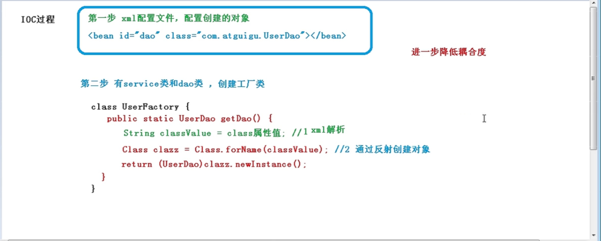
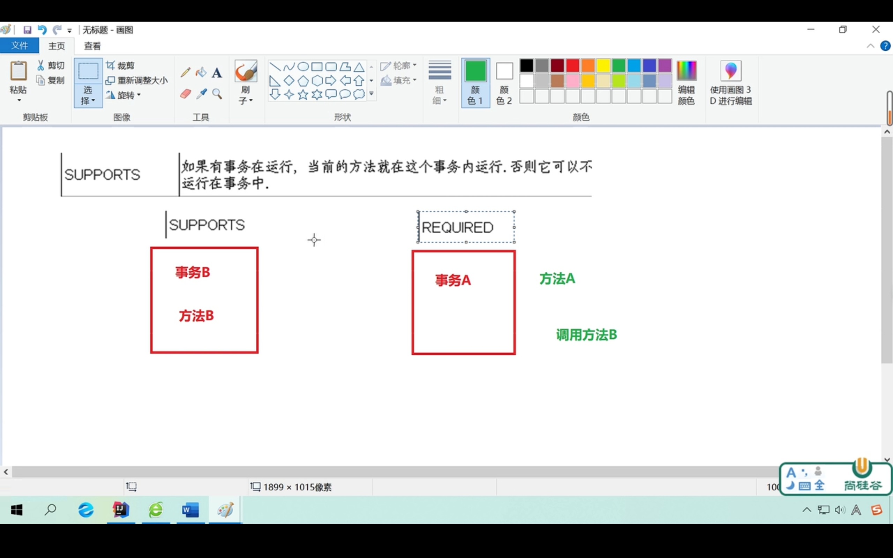

# Spring5

## Spring 框架概述

1. Spring 是轻量级的开源的JavaEE框架

2. Spring 可以解决企业应用开发的复杂性

3. Spring两个核心IOC和Aop

   1)IOC：控制反转

   2)Aop：面向切面

4. Spring特点

5. Spring5开始学习！！！

## 入门前下载相关问题

1）Spring版本：5.2.25

2）下载地址：下不了一点 直接找百度网盘安装包

 Spring 5.2.5压缩包

链接：https://pan.baidu.com/s/1sEKdJx7D-PDnyvNIZIS9sw 
提取码：fc3n

3）jdk版本：1.8

4）导入相关五个基本jar包


其中一个jar包下载地址common-loging-1.1.1.jar包的下载地址https://repo1.maven.org/maven2/commons-logging/commons-logging/1.1.1/

其他jar包spring5文件中都有

## IOC容器

### IOC概念和原理

> 什么是IOC

1)控制反转，把对象创建和对象之间的调用过程，交给Spring进行管理

2）目的：为了耦合度降低

> IOC底层原理

用到：xml解析 工厂模式 反射 

1）IOC过程

a.xml配置文件

b.创建工厂类



> 题外话：工厂模式是什么？

是一种简单的设计模式，是一种解耦的方式，但是工厂还是会有耦合度的，为了进一步降低耦合度，使用IOC容器


### IOC接口（BeanFactory）

1）IOC思想基于IOC容器完成，IOC容器底层就是对象工厂

2）Spring提供IOC容器实现两种方式（两个接口）

> a.BeanFactory:IOC容器基本实现，是Spring内部的接口，一般不提供开发人员使用

*加载配置文件的时候==不会==创建对象，在获取对象（使用）才去创建对象，说人话:==什么时候用什么时候创建对象==

>  b.ApplicationContext：BeanFactory接口的子接口，提供更强大的功能，一般由开发人员使用

*加载配置文件时候就==会==把在配置文件对象进行创建

> ApplicationContext接口的实现类

1)FileSystemXmlApplicationContext

new FileSystemXmlApplicationContext("磁盘下的路径如：D:\java\spring01\src\bean1.xml")

2)ClassPathXmlApplicationContext

new ClassPathXmlApplicationContext("类路径如：bean1.xml")

### IOC操作 Bean管理 

#### 什么是Bean管理

0）Bean管理指的是两个操作：

1）Spring创建对象

2）Spring注入属性

String name

setName()原先的这种方法现在交给Spring来做，这叫注入属性

#### Bean管理操作

##### xml配置文件方式

> 基于xml方式创建对象

\<bean id="user" class="com.zhe.spring5.User">\</bean>

1)在Spring配置文件中，使用==bean标签==，标签里添加对应属性，就可以实现对象创建

2）bean标签中的==常用属性==

*id属性：给你的对象取一个别名，唯一的标识

*class属性：创建对象所在类的全路径（包+类路径）

*name属性：和id一样，不过其中可以加特殊符号，了解即可

3)创建对象的时候，==默认==也是执行==无参构造方法==

> 基于xml方式注入属性

==DI==:依赖注入（注入属性）

**第一种：使用set()方法注入**

1）创建类，定义属性和对应的==set方法==

2）在Spring配置文件配置对象创建，配置属性引入

```xml
     <bean id="book" class="com.zhe.spring5.Book"> 创建对象
         <property name="bname" value="小黄书"></property> 属性注入
         <property name="bauto" value="段元哲"></property>
     </bean>
```

**第二种：使用有参构造进行注入**

1）创建类，定义属性和对应的==有参构造方法==

2）在Spring配置文件配置对象创建，配置属性引入

```xml
 <bean id="zhe" class="com.zhe.spring5.Orders">  创建对象
        <constructor-arg name="oname" value="蛋糕"></constructor-arg>属性注入
        <constructor-arg name="oadress" value="china"></constructor-arg>
    </bean>
```

**第三种（了解）：p名称空间注入**

就是set方法的简化版本

使用这种方式，简化基于xml配置方式

1）添加p名称空间在配置文件中

```xml
<beans xmlns="http://www.springframework.org/schema/beans"
       xmlns:xsi="http://www.w3.org/2001/XMLSchema-instance"
       xmlns:p="http://www.springframework.org/schema/p"//新加个这个即可
       xsi:schemaLocation="http://www.springframework.org/schema/beans http://www.springframework.org/schema/beans/spring-beans.xsd">
```

2）进行属性注入，在bean标签里面进行操作

```xml
     <bean id="book" class="com.zhe.spring5.Book" p:bname="小黄书" p:bauto="段元哲">//现在p名称空间方式实现
<!--         <property name="bname" value="小黄书"></property>-->
<!--         <property name="bauto" value="段元哲"></property>-->//原先set方法实现
     </bean>
```

> xml注入其他属性类型

**字面量**

1)null值

```xml
         <property name="adress">
             <null/>//就是把value这个属性换成了<null/>标签
         </property>
```

2）属性值包含特殊符号

```xml
       <property name="adress"> 要设置的属性值为value="<< 南 京 >>"
            <value><![CDATA[<< 南 京 >>]]></value>
         </property>
也可以用转义 &lt; &gt;
```

**注入属性-外部Bean**

对对象的属性进行注入

需求：

1）创建两个类

2）在一个类中调用另一个类的方法

配置方法：

3）在Spring文件中进行配置

```xml
      <bean id="userService" class="com.zhe.spring5.service.UserService">
            <property name="UserDao" ref="UserDapImpl"></property>name中放的是需要调用方法所在类的名，这个类需要在UserService中定义并且有set方法 name：类里面对象类型的属性名称 ref中放的是创建UserDaoImpl对象bean标签id值
      </bean>
      <bean id="UserDapImpl" class="com.zhe.spring5.dao.UserDaoImpl"></bean>
```

**注入属性-内部Bean**

```xml
      <bean id="emp" class="com.zhe.spring5.bean.Emp">
          <property name="name" value="段元哲"></property>
          <property name="gender" value="男"></property>
          <property name="dept">
               <bean id="dept" class="com.zhe.spring5.bean.Dept">
                   <property name="dname" value="安保"></property>
               </bean>
          </property>
      </bean>
```

**注入属性-级联赋值**

配置外部Bean赋值后再引入到另一个Bean

```xml
       <bean id="emp" class="com.zhe.spring5.bean.Emp">
                     <property name="name" value="段元哲"></property>
                     <property name="gender" value="男"></property>
                      <property name="dept" ref="dept"></property>
                     <property name="dept.dname" value="安保部门"></property>//写法二 需要在Emp中生成个dept的get方法
       </bean>
      <bean id="dept" class="com.zhe.spring5.bean.Dept">
           <property name="dname" value="安保部门"></property>//写法一
      </bean>
```

**注入集合类型属性**

(以set方法方式为例)

1）注入数组类型属性

```xml
 <property name="courses">
                 <array>
                     <value>mysql</value>
                     <value>java</value>
                 </array>
            </property>
```

2）注入List集合类型属性

```xml
  <property name="list">
                  <list>
                       <value>mysql</value>
                      <value>java</value>
                  </list>
            </property>

```

3）注入Map集合类型属性

```xml
    <property name="maps">
                   <map>
                       <entry key="JAVA" value="java"></entry>
                       <entry key="PHP" value="php"></entry>
                   </map>
            </property>
```

*细节*

1）在集合里面设置对象类型值

```xml
 <bean id="stu" class="com.zhe.spring5.bean.Spring.Stu">   
<property name="courseList">
                 <list>
                     <ref bean="course1"></ref> 引入对象
                     <ref bean="course2"></ref>
                 </list>
            </property>
        </bean>
两个对象 为他两个设置值 在外面设置
    <bean id="course1" class="com.zhe.spring5.bean.Spring.Course">
        <property name="courseName" value="mhyhsql"></property>

    </bean>

  <bean id="course2" class="com.zhe.spring5.bean.Spring.Course">
      <property name="courseName" value="java"></property>
  </bean>
```

上面这种方法只能用在bean中 只有一个类可以使用，我想让多个类使用该怎么办呢？

2）把集合注入部分提取出来

提取出来作为公共部分

1）在Spring配置文件中引入名称空间util

```xml
<beans xmlns="http://www.springframework.org/schema/beans"
       xmlns:xsi="http://www.w3.org/2001/XMLSchema-instance"
       xmlns:util="http://www.springframework.org/schema/util"
       xsi:schemaLocation="http://www.springframework.org/schema/beans http://www.springframework.org/schema/beans/spring-beans.xsd
        http://www.springframework.org/schema/util http://www.springframework.org/schema/util/spring-util.xsd">
```

2)使用util标签实现注入集合标签（以注入list为例）

```xml
   1）设置属性
<util:list id="bookList">
         <value>水浒传</value>
        <value>西游记</value>
        <value>红楼梦</value>
    </util:list>
   2）注入
    <bean id="book" class="com.zhe.spring5.bean.Spring.Book">
        <property name="list" ref="bookList"></property> 将ref里面的bookList注入到name当中的list里面
    </bean>
```

##### FactoryBean

String有两种类型的Bean,一种普通Bean,一种工厂Bean(FactoryBean)

**普通Bean**

在配置文件中定义Bean类型就是返回类型

**工厂Bean**

在配置文件中定义Bean类型可以和返回类型不一样

1）创建类，让这个类作为工厂Bean，实现接口FactoryBean

2)实现接口里面的方法，在实现的方法中定义返回的Bean类型

这样就可以实现即使在配置文件中配置的是一个类（工厂类），返回值却是另一个类（工厂类中方法返回的类型）

```Java
@Override
    public boolean isSingleton() {
        return FactoryBean.super.isSingleton();
    }
//定义返回的Bean类型
    @Override
    public Course getObject() throws Exception {
        Course course = new Course();
        course.setCourseName("Java");
        return course;
    }
    @Override
    public Class<?> getObjectType() {
        return null;
    }
```

##### Bean作用域

**单实例和多实例**

1）在Spring里面，设置创建Bean实例是单实例还是多实例

2）默认是单实例对象

3）如何设置单实例还是多实例

**scope属性**

1）Spring配置文件bean标签里面属性scope用于设置单实例还是多实例

2）默认值singleton,表示是单实例对象

3）属性值prototype,表示是多实例对象

**二者区别**

singleton==加载==Spring配置文件时候就会创建单实例对象

prototype在==调用getBean方法==时候创建多实例对象

##### Bean生命周期

**生命周期**

从对象创建到对象销毁的过程

**bean生命周期**

1)通过构造器创建bean实例（==无参构造==）

2)为bean的属性==设置值==和对其他bean引用（调用set方法）

3)调用bean的==初始化==的方法（需要进行配置 init-method=""）

4)bean 对象可以使用了（==获取到了==）

5)当容器关闭时，调用bean==销毁==方法（需要配置 destroy-method="" ）

**bean后置处理器**

1)通过构造器创建bean实例（==无参构造==）

2)为bean的属性==设置值==和对其他bean引用（调用set方法）

** 把bean实例传递bean后置处理器的方法postProcessBeforeInitialization

3)调用bean的==初始化==的方法（需要进行配置 init-method=""）

** 把bean实例传递bean后置处理器的方法postProcessAfterInitialization

4)bean 对象可以使用了（==获取到了==）

5)当容器关闭时，调用bean==销毁==方法（需要配置 destroy-method="" ）

##### 自动装配（xml方式）

> 什么是自动装配

根据指定装配规则（属性名称或者属性类型），Spring自动将匹配的属性值进行注入

**autowire标签**

bean标签==autowire==,配置自动装配

**属性值**

==byName== 根据属性名称注入，注入值bean的id值要和类属性名称一样

==byType== 根据属性类型注入

```xml
         <bean id="emp" class="com.zhe.spring5.bean.bean.Emp" autowire="byType">
<!--             <property name="dept" ref="dept"></property>   就是代替了这部分-->  
         </bean>
    <bean id="dept2" class="com.zhe.spring5.bean.bean.Dept">
          <property name="name" value="财务部"></property>
    </bean>
```


##### 引入外部属性文件（xml方式）jdbc没学过暂时跳过

>  直接配置数据库信息

1）配置德鲁伊连接池

2）引入德鲁伊连接池依赖jar包

德鲁伊jar包下载地址

https://repo1.maven.org/maven2/com/alibaba/druid/1.1.9/

要下载名称为druid-1.1.9.jar的不要有后缀，有后缀的不全

好像还有弄jdbc的包啊

这一集（p19）应该有jdbc没学过的知识先==暂时跳过==

> 引入外部属性文件配置数据库

##### 注解配置文件方式

> 什么是注解

1)注解是代码特殊标记，格式：@注解（属性名称=属性值，属性名称=属性值...）

2)注解作用在类上面，方法上面，属性上面

3）使用目的：简化xml配置

> 基于注解方式实现对象创建

**创建对象注解种类**

1）@Component

2）@Service

3）@Controller

4）@Repository

功能相同，都可以用来创建bean实例

**基于注解方式创建对象实现流程**

1）引入依赖


2）开启组件扫描

在spring配置文件中

引入contxt,然后用标签开启组件扫描

```xml
<beans xmlns="http://www.springframework.org/schema/beans"
       xmlns:xsi="http://www.w3.org/2001/XMLSchema-instance"
       xmlns:context="http://www.springframework.org/schema/context"
       xsi:schemaLocation="http://www.springframework.org/schema/beans http://www.springframework.org/schema/beans/spring-beans.xsd
        http://www.springframework.org/schema/context http://www.springframework.org/schema/context/spring-context.xsd">
           <context:component-scan base-package="com.zhe.spring5"></context:component-scan>进行组件扫描，如果扫描多个包就用逗号隔开，扫描包上层目录
</beans>
```

注意：

```xml
<!-- 不扫描包中全部类-->
       <context:component-scan base-package="com.zhe.spring5" use-default-filters="false">
<!-- 扫描带该注解的类-->
              <context:include-filter type="annotation"
                                      expression="org.springframework.stereotype.Component"/>
       </context:component-scan>

<!--扫描包中全部类-->
       <context:component-scan base-package="com.zhe.spring5">
<!-- 不扫描带该注解的类-->
                 <context:exclude-filter type="annotation" expression="org.springframework.stereotype.Component"/>
       </context:component-scan>
```

3）创建类，在类上面添加创建对象注解

注意：在注解里面value的属性值即为bean标签的id值

可省略不写，默认值是类名称首字母小写

> 基于注解方式实现属性注入

**注入属性注解种类**

1）@AutoWired:根据属性类型进行注入

第一步:在两个类中添加==创建对象==注解

第二步:在其中一个类中添加另一个类的==属性==，在属性上面使用注解（不需要添加set方法）

2）@Qualifier：根据属性名称注入

和上面@AutoWired一起使用

3）@Resource：可以根据类型，也可以根据名称进行注入

@Resource 根据类型注入

@Resource(name = "ddd") 根据名称注入，就是创建对象注解里面的名称@Component(value = "ddd")

4）@Value:注入普通类型

```java
@Value(value = "abc")
private String name;    将abc注入到name
```

**完全注解开发**

1）创建配置文件，替代xml配置文件

```java 
@Configuration   代表这是配置文件
@ComponentScan(basePackages = {"com.zhe.spring5"}) 配置文件的扫描范围
public class springConfig {
}
```

2）测试类写法

```java
    @Test
    public void test3() {
        ApplicationContext context = new AnnotationConfigApplicationContext(springConfig.class);  注意这里没有双引号！！！！
        service2 service2 = context.getBean("service2", service2.class);
        System.out.println(service2);
        service2.add();
    }
```

## AOP

### AOP概念和原理

> 什么是AOP

1）面向切面编程，隔离业务逻辑各个部分，使耦合度降低，提高程序可重用性

2）人话：不通过修改源代码的方式，在主干功能里面添加新功能 

3）通过登录例子来理解


> AOP底层原理

**AOP底层使用动态代理**

1）有接口情况，使用JDK动态代理

- 创建接口实现类代理对象，增强类的方法


2）没有接口情况，使用CGLIB动态代理

- 创建子类的代理对象，增强类的方法


> JDK动态代理实现

1.使用JDK动态代理，使用Proxy类里面的方法创建代理对象

1)调用newProxyInstance方法

方法的三个参数

第一个参数：类加载器

第二个参数：增强方法所在的类，这个类实现的接口，支持多个接口

第三个参数：实现这个接口InvocationHandler，创建代理对象，写增强的方法

> 编写代码实现JDK动态代理

1)创建接口，定义方法 （UserDao）定义的方法是add()

2)创建接口实现类，实现方法（User）

3)使用Proxy类创建接口代理对象

```java
public class JDKProxy {
    public static void main(String[] args) {
        //创建接口实现类代理对象
        Class[] interfaces = {UserDao.class};
        UserDao dao = (UserDao)Proxy.newProxyInstance(JDKProxy.class.getClassLoader(), interfaces, new UserDaoProxy(new User()));
        int result = dao.add(1, 2);
        System.out.println(result);

    }


    //创建代理对象
    static  class UserDaoProxy implements InvocationHandler{

        //把创建的是谁的代理对象，把谁传递过来
        //有参数构造传递
        private Object obj;
        public UserDaoProxy(Object obj){
            this.obj = obj;
        }

        //增强的逻辑
        @Override
        public Object invoke(Object proxy, Method method, Object[] args) throws Throwable {

            //方法之前
            System.out.println("方法之前执行。。。。" + method.getName() + "传递的参数。。。" + Arrays.toString(args));


            //增强的方法
            Object res = method.invoke(obj, args);


            //方法之后
            System.out.println("方法之后执行。。。。" + obj);
            return res;
        }
    }
}

```

### AOP操作术语

**连接点**

类里面哪些方法可以被增强，这些方法称为连接点

**切入点**

实际被增强的方法，称为切入点

**通知（增强）**

1）实际增强的逻辑部分称为通知（增强）

2）通知有多种类型

- 前置通知

- 后置通知
- 环绕通知
- 异常通知
- 最终通知

**切面**

把通知应用到切入点的过程

### AOP操作(准备工作)

> Spring框架一般都是基于AspectJ实现AOP操作

**什么是AspectJ**

AspectJ不是Spring组成部分，是独立AOP框架，一般把AspectJ和Spring框架一起使用，进行AOP操作

> 基于AspectJ实现AOP操作

1）基于xml配置文件实现

2）基于注解方式实现

> 在项目工程中引入AOP相关依赖

jar包下载连接在这里[Spring/AOP at main · Aha-lxj/Spring · GitHub](https://github.com/Aha-lxj/Spring/tree/main/AOP)

赶紧用maven吧hh...

> 切入点表达式

1）作用：知道对哪个类里面的哪个方法进行增强

2）语法结构

execution(【权限修饰符】【返回类型】 【类全路径】 【方法名称】 （【参数列表】）)

注意：权限修饰符可以省略，返回类型不能省略，可以用通配符*来表示，参数列表可以用..来表示

### AOP操作（AspectJ注解）

1）创建类，在类里面定义方法

2）创建增强类（编写增强逻辑）

在增强类里面创建方法，让不同方法代表不同通知类型

3）进行通知的配置

- 在Spring配置文件中，进行注解扫描

  ```xml
  <?xml version="1.0" encoding="UTF-8"?>
  <beans xmlns="http://www.springframework.org/schema/beans"
         xmlns:xsi="http://www.w3.org/2001/XMLSchema-instance"
         xmlns:context="http://www.springframework.org/schema/context"
         xmlns:aop="http://www.springframework.org/schema/aop"
         xsi:schemaLocation="http://www.springframework.org/schema/beans http://www.springframework.org/schema/beans/spring-beans.xsd
  
      http://www.springframework.org/schema/context http://www.springframework.org/schema/context/spring-context.xsd
      http://www.springframework.org/schema/aop http://www.springframework.org/schema/aop/spring-aop.xsd">
  
  
  <!--    注解扫描-->
      <context:component-scan base-package="com.zhe.spring5.aop"></context:component-scan>
  
  
  ```

  

- 使用注解创建类和增强类的对象

-  在增强类上面添加注解@Aspect

- 在Spring配置文件中开启生成代理对象

  ```xml
      <aop:aspectj-autoproxy></aop:aspectj-autoproxy>
  ```
  4)配置不同类型的通知

  在增强类里面，在作为通知方法上面添加通知类型注解，使用切入点表达式配置

  ```java
  package com.zhe.spring5.aop;
  
  import org.aspectj.lang.ProceedingJoinPoint;
  import org.aspectj.lang.annotation.*;
  import org.springframework.stereotype.Component;
  
  @Component
  @Aspect//生成代理对象
  public class UserProxy {
  
  
      //前置通知
      @Before(value = "execution(* com.zhe.spring5.aop.User.add(..))")
      public void before(){
          System.out.println("before...");
      }
      //最终通知
     //在方法执行之后执行，不管有没有异常都会执行
      @After("execution(* com.zhe.spring5.aop.User.add(..))")
      public void after(){
          System.out.println("after......");
      }
     //后置通知(返回通知)
     //在方法返回结果之后执行，有异常出现就不执行
      @AfterReturning("execution(* com.zhe.spring5.aop.User.add(..))")
      public void afterReturning(){
          System.out.println("afterReturning.......");
      }
     //异常通知,出现异常之后执行
      @AfterThrowing("execution(* com.zhe.spring5.aop.User.add(..))")
      public void afterThrowing(){
          System.out.println("afterThrowing.......");
      }
      //环绕通知
      @Around("execution(* com.zhe.spring5.aop.User.add(..))")
      public void around(ProceedingJoinPoint proceedingJoinPoint) throws Throwable{
  
          System.out.println("环绕之前.......");
  
          //被增强的方法执行
  
          proceedingJoinPoint.proceed();
          System.out.println("环绕之后.......");
      }
  }
  
  ```

  

5）相同的切入点抽取

```java
    //相同切入点抽取
    @Pointcut(value = "execution(* com.zhe.spring5.aop.User.add(..))")
    public void pointDemo(){
        
    }
    //前置通知
    @Before(value = "pointDemo()")
    public void before(){
        System.out.println("before...");
    }
```

6)多个增强类对同一个方法进行增强，设置增强类优先级

在增强类上面添加注解@Order(数字类型值)，值越小，优先级越高

7)完全注解开发

创建配置类，不需要创建xml配置文件

```Java
@Configuration
@ComponentScan(basePackages = {"com.zhe.spring5.aop"})
@EnableAspectJAutoProxy(proxyTargetClass = true)
public class configAop {
}

```


### AOP操作（AspectJ配置文件）了解即可

1）创建两个类，增强类和被增强类，在类里面定义方法

2）在Spring配置文件中创建两个类对象

```xml
         <bean id="book" class="com.zhe.spring5.aop_xml.Book"></bean>
         <bean id="bookProxy" class="com.zhe.spring5.aop_xml.BookProxy"></bean>
```

3）在Spring配置文件中配置切入点

```xml
<!--    配置aop增强-->
    <aop:config>
<!--            切入点-->
        <aop:pointcut id="p" expression="execution(* com.zhe.spring5.aop_xml.Book.add(..))"/>
<!--        配置切面-->
        <aop:aspect ref="bookProxy">
                  <aop:before method="before" pointcut-ref="p"></aop:before>
        </aop:aspect>
    </aop:config>
```

## 事务

### 事务概念

> 什么是事务

事务是数据库操作的基本单元，逻辑上一组操作，要么都成功，如果有一个失败所有的操作都失败

> 事务四个特性（ACID）

1）原子性

2）一致性

3）隔离性

4）持久性

### 搭建事务操作环境

（需要jdbc技术啊。。。ok学成归来，继续事务）

1）使用JdbcTemplate需要先引入jar包


2）场景：经典转账，1号向2号转100块钱


==实现步骤==

1）创建数据库表，添加记录

2）创建service 搭建dao,完成对象创建和注入关系

3）创建转账方法，实现转账

==xml配置==

```xml
<!-- 组件扫描-->
    <context:component-scan base-package="com.zhe"></context:component-scan>

<!--创建数据库连接池  德鲁伊连接池-->
    <bean id="dataSouce" class="com.alibaba.druid.pool.DruidDataSource" destroy-method="close">
        <property name="url" value="jdbc:mysql:///atguigu"/>
        <property name="username" value="root"/>
        <property name="password" value="dyz200472"/>
        <property name="driverClassName" value="com.mysql.cj.jdbc.Driver"/> 注意mysql8+要有cj
    </bean>
<!--创建jdc模板-->
    <bean id="jdbcTemplate" class="org.springframework.jdbc.core.JdbcTemplate">
         <property name="dataSource" ref="dataSouce"></property>
    </bean>
```

==dao中代码==

```java
@Repository
public class UserDaoImpl implements UserDao {//UserDao是自己实现的接口，里面定义了两个转账方法
    @Autowired//注入jdbc模板对象
    private JdbcTemplate jdbcTemplate;

    @Override
    public void addMoney() {
     String sql = "update t_bank set money=money+? where id = ?";
        jdbcTemplate.update(sql,100,2);
    }

    @Override
    public void subMoney() {
      String sql = "update t_bank set money=money-? where id = ?";
      jdbcTemplate.update(sql,100,1);
    }
}

```

==service层代码==

```java
@Service(value = "userService")
public class UserService {
//注入UserDao
    @Autowired
    private UserDao userDao;

    public void accountMoney(){
        userDao.subMoney();
        userDao.addMoney();
    }
}
```

==大致逻辑==：在service层注入dao,在dao层注入JdbcTemplate，在JdbcTemplate中又注入数据库连接池

### 事务场景引入

> 发现问题

如果转账时，subMoney方法后面出现了异常，就会出现1号钱少了，但是因为异常导致程序中断导致2号钱没有增加，于是1号：我钱呢？哎不对我钱呢？

> 解决问题

*使用事务进行解决，用事务就可以拯救1号的钱钱~

*事务操作过程

1）开启事务

2）进行业务操作

3）没有异常：提交事务 出现异常：事务回滚

### Spring事务管理介绍

> 事务添加地点

事务添加到javaEE三层结构里面的Service层（业务逻辑层）

> 在Spring进行事务管理操作

1）有两种方式：==编程式==事务管理和==声明式==事务管理

2）编程式就是在代码中写，spring中一般使用声明式事务管理

> 声明式事务管理

1）基于注解方式

2）基于xml方式

3）==底层使用AOP原理==

> Spring事务管理API

提供一个接口，代表事务管理器，这个接口针对不同的框架实现不同的实现类


PS:idea快捷键ctrl+h 查看向下或者向上的继承操作

### Spring声明式事务管理-注解方式实现

>  1.在Spring配置文件中配置事务管理器

```xml
<!--    创建事务管理器-->
    <bean id="TransactionManager" class="org.springframework.jdbc.datasource.DataSourceTransactionManager">
        <!--   注入数据源-->
        <property name="dataSource" ref="dataSouce"></property>
    </bean>
```

>  2.在Spring配置文件中，开启事务注解

1）引入名称空间tx

```xml
<?xml version="1.0" encoding="UTF-8"?>
<beans xmlns="http://www.springframework.org/schema/beans"
       xmlns:xsi="http://www.w3.org/2001/XMLSchema-instance"
       xmlns:context="http://www.springframework.org/schema/context"
       xmlns:aop="http://www.springframework.org/schema/aop"
       xmlns:tx="http://www.springframework.org/schema/tx"
       xsi:schemaLocation="http://www.springframework.org/schema/beans http://www.springframework.org/schema/beans/spring-beans.xsd

    http://www.springframework.org/schema/context http://www.springframework.org/schema/context/spring-context.xsd
    http://www.springframework.org/schema/aop http://www.springframework.org/schema/aop/spring-aop.xsd
    http://www.springframework.org/schema/tx http://www.springframework.org/schema/tx/spring-tx.xsd
">

```

2)开启事务注解

```xml
<!--开启事务注解-->
<tx:annotation-driven transaction-manager="TransactionManager"></tx:annotation-driven>
```

> 3.在Service类上面（或者Service类里面的方法上面）添加事务注解

1）@Transactional,可以添加到类上面，也可以添加到方法上面

2）如果添加到类上面，为这个类里面所有的方法都添加事务

3）如果添加到方法上面，为这个方法添加事务

### Sping声明式事务管理-事务参数

#### 传播行为

> propagation:事务传播行为

1）当一个事务方法被另一个事务方法调用时，这个事务方法如何进行

2）Spring定义了7种类传播行为，重点记住以下三种

required:如果有事务在运行，当前方法就在这个事务内运行，否则，就启动一个新的事务，并在新的事务内运行


required_new:当前的方法必须启动新事务，并在它自己的事务内运行，如果有事务正在运行，应该将它挂起


supports:如果有事务在运行，当前的方法就在这个事务内运行，否则它可以不运行在事务中



#### 隔离级别

> ioslation:事务隔离级别

1）事务的特性之一隔离性，使得多事务操作之间不会产生影响，不考虑隔离性会产生很多问题

2）产生的读问题：脏读，不可重复读，虚（幻）读

==脏读==

一个未提交事务读取到另一个未提交事务的数据


岳不群改变金额后，东方不败读取到数据，但是岳不群进行事务回滚，没有提交，对数据库进行修改，发生了脏读

==不可重复读==

一个未提交事务读取到另一个提交事务==修改==数据

导致一个事务先后读取同一条记录，但两次读取的数据不同,即不可重复读


==幻读==

一个未提交事务读取到另一个提交事务==添加==数据

3）通过设置事务隔离级别，解决读问题

级别分类


设置隔离级别，MySQL默认REPEATABLE_READ这个级别

```java
@Transactional(propagation = Propagation.REQUIRED,isolation = Isolation.REPEATABLE_READ)
```


#### 其他参数

==timeout==

1）事务需要在一定时间内进行提交，如果不提交进行回滚

2）默认值是-1，设置时间以秒单位进行计算

==readOnly==：是否只读

1）读：查询操作，写：添加修改删除操作

2）默认值false,表示可以查询，添加修改删除操作

3）设置为true之后，只能查询

==rollbackFor==:回滚

设置出现哪些异常进行事务回滚

==noRollbackFor==:不回滚

设置出现哪些异常不进行事务回滚

### Spring声明式事务管理-完全注解开发

> 配置类

```java
Configuration//配置类
@ComponentScan(basePackages = "com.zhe")//组件扫描
@EnableTransactionManagement//开启事务
public class TxConfig {
    //创建数据库连接池
    @Bean
    public DruidDataSource getDruidDataSource(){
        DruidDataSource druidDataSource = new DruidDataSource();
        druidDataSource.setDriverClassName("com.mysql.cj.jdbc.Driver");//驱动
        druidDataSource.setUrl("jdbc:mysql:///atguigu");//数据库地址
        druidDataSource.setUsername("root");
        druidDataSource.setPassword("dyz200472");
        return druidDataSource;
    }

    //创建jdbcTemplate对象
    @Bean
    //到ioc容器中找到DruidDataSource
    public JdbcTemplate getjdbcTemplate(DruidDataSource druidDataSource){
        JdbcTemplate jdbcTemplate = new JdbcTemplate();
        //注入DruidDataSource
        jdbcTemplate.setDataSource(druidDataSource);
        return jdbcTemplate;
    }
    //创建事务管理器对象
    @Bean
    public DataSourceTransactionManager getDataSourceTransactionManager(DruidDataSource druidDataSource){
        DataSourceTransactionManager dataSourceTransactionManager = new DataSourceTransactionManager();
        dataSourceTransactionManager.setDataSource(druidDataSource);
        return dataSourceTransactionManager;
    }
}
```

> 测试类

```java
    @Test
    public void test2(){
        ApplicationContext context = new AnnotationConfigApplicationContext(TxConfig.class);
        UserService userService = context.getBean("userService", UserService.class);
        userService.accountMoney();
    }
```

# SpringMVC

前置知识：maven,thymeleaf,vue

## 前置知识-Thymeleaf

> 模板

对后台开发人员很友好，适合后台管理系统

FreeMarker,Thymeleaf,Velocity

> Thymeleaf介绍

服务器端的模板引擎，可用于web项目和非web项目

模板引擎的工作原理：在服务器端获取模板和数据，生成结果输出给浏览器呈现效果


> Thymeleaf的使用

步骤1添加依赖

```xml
 <!-- Spring5和Thymeleaf整合包 -->
<dependency>
      <groupId>org.thymeleaf</groupId>
      <artifactId>thymeleaf-spring5</artifactId>
      <version>3.0.12.RELEASE</version>
    </dependency>
```

步骤2：使用模板

第一种方式：模板直接使用数据

```java
public void test(){
    //创建模板引擎
    TemplateEngine engine = new TemplateEngine();
    //准备模板
    String inStr = "<input type='text' th:value='${name}'>"//如果想使用模板，只有th:后面的属性才可以被模板解析
    //准备数据
    Context context = new Context();
    context.setVariable("name","张三");
    //处理模板和数据
    String html = engine.process(inStr,context);
    System.out.println(html);
}
```

第二种方式：使用模板文件

```Java
public void test(){
    //创建模板引擎
    TemplateEngine engine = new TemplateEngine();
    //读取磁盘中的模板文件
    ClassLoaderTemplateResolver resolver = new ClassLoaderTemplateResolver();
    //设置引擎使用resolver
    engine.setTemplateResolver(resolver);
    //准备数据
    Context context = new Context();
    context.setVariable("name","张三");
    //处理模板和数据
    String html = engine.process("main.html",context);//main.html是模板文件
    System.out.println(html);
}
```

第三种方式：设置模板前缀后缀

可以减少对文件的指定，使得使用模板文件更加方便

```java
public void test(){
    //创建模板引擎
    TemplateEngine engine = new TemplateEngine();
    //读取磁盘中的模板文件
    ClassLoaderTemplateResolver resolver = new ClassLoaderTemplateResolver();
    //设置前缀指定路径
    resolver.setPrefix("templates/");//指定从resources/templates下寻找模板文件
    //设置后缀指定模板文件类型
    resolver.setSuffix(".html");
    //设置引擎使用resolver
    engine.setTemplateResolver(resolver);
    //准备数据
    Context context = new Context();
    context.setVariable("name","张三");
    //处理模板和数据
    String html = engine.process("index",context);//模板文件index.html在resources/templates下
    System.out.println(html);
}
```


## SpringMVC简介

### 什么是MVC

> MVC是一种软件架构的思想，将软件按照模型，视图，控制器来划分

==M==

Model，模型层，工程中的javaBean,作用是处理数据

==V==

View,视图层，指工程中的html或jsp等页面，作用是与用户进行交互，展示数据

==C==

Controller,控制层，指工程中的servlet,作用是接收请求和响应浏览器

> MVC的工作流程


### 什么是SpringMVC

1）Java轻量级web开发框架

2）是Spring的一个子项目，业界作为java EE项目表述层开发的首选方案

三层架构：表述层，业务逻辑层，数据访问层

表述层表示前台界面和后台servlet

### SpringMVC特点

- Spring家族**原生产品**，与IOC容器等基础设施无缝对接
- 基于**原生Servlet**,通过前端控制器**DispatcherServlet**，对请求和响应进行统一处理
- 表述层各细分领域需要解决的问题**全方位覆盖**，提供**全面解决方案**
- **代码清新简洁**，大幅度提升开发效率
- 内部组件化程度高，可插拔式组件**即插即用**，想要什么功能配置相应组件即可
- **性能卓著**，尤其适合现代大型、超大型互联网项目要求

## HelloWorld!

### 开发环境

jdk8+spring5+tomcat9 (tomcat10不可以)+maven3.8

### 开发步骤

> 创建maven工程

1）添加web模块

2）pom.xml中打包方式改为war

3)pom.xml中引入依赖

```xml
<dependencies>
    <!-- SpringMVC -->
    <dependency>
        <groupId>org.springframework</groupId>
        <artifactId>spring-webmvc</artifactId>
        <version>5.3.1</version>
    </dependency>

    <!-- 日志 -->
    <dependency>
        <groupId>ch.qos.logback</groupId>
        <artifactId>logback-classic</artifactId>
        <version>1.2.3</version>
    </dependency>

    <!-- ServletAPI -->
    <dependency>
        <groupId>javax.servlet</groupId>
        <artifactId>javax.servlet-api</artifactId>
        <version>3.1.0</version>
        <scope>provided</scope>
    </dependency>

    <!-- Spring5和Thymeleaf整合包 -->
    <dependency>
        <groupId>org.thymeleaf</groupId>
        <artifactId>thymeleaf-spring5</artifactId>
        <version>3.0.12.RELEASE</version>
    </dependency>
</dependencies>
```

注：由于 Maven 的传递性，我们不必将所有需要的包全部配置依赖，而是配置最顶端的依赖，其他靠传递性导入。

> 配置web.xml

注册SpringMVC的前端控制器**DispatcherServlet**

```xml
<!-- 配置SpringMVC的前端控制器，对浏览器发送的请求统一进行处理 -->
<servlet>
    <servlet-name>springMVC</servlet-name>
    <servlet-class>org.springframework.web.servlet.DispatcherServlet</servlet-class>
    <!-- 通过初始化参数指定SpringMVC配置文件的位置和名称 -->
    <init-param>
        <!-- contextConfigLocation为固定值 -->
        <param-name>contextConfigLocation</param-name>
        <!-- 使用classpath:表示从类路径查找配置文件，例如maven工程中的src/main/resources -->
        <param-value>classpath:springMVC.xml</param-value>
    </init-param>
    <!-- 
 		作为框架的核心组件，在启动过程中有大量的初始化操作要做
		而这些操作放在第一次请求时才执行会严重影响访问速度
		因此需要通过此标签将启动控制DispatcherServlet的初始化时间提前到服务器启动时
	-->
    <load-on-startup>1</load-on-startup>
</servlet>
<servlet-mapping>
    <servlet-name>springMVC</servlet-name>
    <!--
        设置springMVC的核心控制器所能处理的请求的请求路径
        /所匹配的请求可以是/login或.html或.js或.css方式的请求路径
        但是/不能匹配.jsp请求路径的请求
    -->
    <url-pattern>/</url-pattern>
</servlet-mapping>
```

注：

\<url-pattern>标签中使用/和/*的区别：

/所匹配的请求可以是/login或.html或.js或.css方式的请求路径，但是/不能匹配.jsp请求路径的请求

因此就可以避免在访问jsp页面时，该请求被DispatcherServlet处理，从而找不到相应的页面

/*则能够匹配所有请求，例如在使用过滤器时，若需要对所有请求进行过滤，就需要使用/\*的写法

> 创建请求控制器

创建控制类，上面添加@Controller注解将其标识为一个控制层组件，交给Spring的IOC容器管理，此时SpringMVC才能识别到控制器的存在

```java
@Controller
public class HelloController {
    
}
```

> 创建SpringMVC的配置文件

```xml
<!-- 自动扫描包 -->
<context:component-scan base-package="com.atguigu.mvc.controller"/>

<!-- 配置Thymeleaf视图解析器 -->
<bean id="viewResolver" class="org.thymeleaf.spring5.view.ThymeleafViewResolver">
    <property name="order" value="1"/>
    <property name="characterEncoding" value="UTF-8"/>
    <property name="templateEngine">
        <bean class="org.thymeleaf.spring5.SpringTemplateEngine">
            <property name="templateResolver">
                <bean class="org.thymeleaf.spring5.templateresolver.SpringResourceTemplateResolver">
    
                    <!-- 视图前缀 -->
                    <property name="prefix" value="/WEB-INF/templates/"/>
    
                    <!-- 视图后缀 -->
                    <property name="suffix" value=".html"/>
                    <property name="templateMode" value="HTML5"/>
                    <property name="characterEncoding" value="UTF-8" />
                </bean>
            </property>
        </bean>
    </property>
</bean>
```

> 测试helloworld

**实现对首页的访问**

请求控制器处理请求的方法

```java
// @RequestMapping注解：处理请求和控制器方法之间的映射关系
// @RequestMapping注解的value属性可以通过请求地址匹配请求，/表示的当前工程的上下文路径
// localhost:8080/springMVC/
@RequestMapping("/")
public String index() {
    //设置视图名称
    return "index";
}
```

**通过超链接跳转到指定界面**

在主页index.html中设置超链接

```html
<!DOCTYPE html>
<html lang="en" xmlns:th="http://www.thymeleaf.org">//这个部分一定要有，idea可以通过设置使得每次新建你html文件自带这部分
<head>
    <meta charset="UTF-8">
    <title>首页</title>
</head>
<body>
    <h1>首页</h1>
    <a th:href="@{/hello}">HelloWorld</a><br/>
</body>
</html>
```

在请求控制器中创建处理请求的方法

```java
@RequestMapping("/hello")
public String HelloWorld() {
    return "target";
}
```

> 项目结构


## @RequestMapping注解

### @RequestMapping注解介绍

> @RequestMapping注解的功能

讲请求和处理请求的控制器方法关联起来，建立映射关系

浏览器发送请求，SpringMVC 接收到指定的请求，就会来找到在映射关系中对应的控制器方法来处理这个请求。

> @RequestMapping注解的位置

@RequestMapping标识一个类：设置映射请求的请求路径的初始信息

@RequestMapping标识一个方法：设置映射请求请求路径的具体信息

```java
@Controller
@RequestMapping("/test")
public class RequestMappingController {

	//此时请求映射所映射的请求的请求路径为：/test/testRequestMapping
    @RequestMapping("/testRequestMapping")
    public String testRequestMapping(){
        return "success";
    }

}
```

### @RequestMapping注解属性

> @RequestMapping注解的value属性

1）通过请求的==请求地址==匹配请求映射

2）是一个字符串类型的数组，表示该请求映射能够匹配多个请求地址所对应的请求

3）==必须设置==，至少通过请求地址匹配请求映射

> @RequestMapping注解的method属性

1）通过请求的==请求方式==（get或post）匹配请求映射

2）method属性是一个RequestMethod类型的数组，表示该请求映射能够匹配多种请求方式的请求

3)若当前请求的请求地址满足请求映射的value属性，但是请求方式不满足method属性，则浏览器报错405：Request method 'POST' not supported

4）如果不设置这个属性，默认任何请求方式都可以

> 注：

1、对于处理指定请求方式的控制器方法，SpringMVC中提供了@RequestMapping的派生注解

处理get请求的映射-->@GetMapping

处理post请求的映射-->@PostMapping

处理put请求的映射-->@PutMapping

处理delete请求的映射-->@DeleteMapping

2、常用的请求方式有get，post，put，delete

但是目前浏览器只支持get和post，若在form表单提交时，为method设置了其他请求方式的字符串（put或delete），则按照默认的请求方式get处理

若要发送put和delete请求，则需要通过spring提供的过滤器HiddenHttpMethodFilter，在RESTful部分会讲到

> @RequestMapping注解的params属性(了解)

1)value与method里面的参数都是满足一个即可，params和Headers属性里面的参数必须同时满足

2)通过请求的==请求参数==匹配映射

3）是一个字符串类型的数组，可以通过四种表达式设置请求参数和请求映射的匹配关系

四种参数表达式：

"param"：要求请求映射所匹配的请求必须携带param请求参数

"!param":要求请求映射所匹配的请求必须不能携带param请求参数

"param=value":要求必须携带param请求参数且param=value

"param！=value":要求必须携带param请求参数但是param！=value 

> @RequestMapping注解的Headers属性(了解)

1）通过请求的==请求头==匹配映射

2）是一个字符串类型的数组，可以通过四种表达式设置请求参数和请求映射的匹配关系

四种参数表达式：

"header"：要求请求映射所匹配的请求必须携带header请求头信息

"!header"：要求请求映射所匹配的请求必须不能携带header请求头信息

"header=value"：要求请求映射所匹配的请求必须携带header请求头信息且header=value

"header！=value"：要求请求映射所匹配的请求必须携带header请求头信息且header！=value

### SpringMVC支持ant风格的路径

实现模糊匹配，在@RequestMapping的value属性值中使用ant风格的路径

?:表示任意的单个字符,（处了\和?）

*：表示任意的0个或多个字符，（除了\和?）

**：表示任意的一层或多层目录，这样\*\*代表的部分就可以用多个/啦

注意：在使用**时，只能使用/\*\*/xxx的形式

如果这样写：/a\*\*a/xxx就会把**解析为两个\*

### SpringMVC支持路径中的占位符（重点）

原始传参方式：/deleteUser?id=1

restful风格传参方式：/deleteUser/1

SpringMVC通过占位符实现这种传参方式，在RESTful风格中，当请求路径中将某些数据通过路径的方式传输到服务器，可以在==RequestMapping注解的value属性==中通过占位符=={xxx}==表示传输的数据，再通过==@PathVariable==注解，将占位符表示的数据赋值给控制器的形参

index代码

```xml
<a th:href="@{/testRest/1/admin}">测试占位符</a>
```
控制器代码
```java
  @RequestMapping("/testRest/{id}/{username}")
    //@PathVariable注解将占位符中的内容赋值给形参
    public String testRest(@PathVariable("id") Integer id,@PathVariable("username") String username){
        System.out.println("id:"+id + ",username:" + username);
        return "sucess";
    }
//最终输出的内容为-->id:1,username:admin
```

## SpringMVC获取请求参数

### 通过ServletAPI获取

```java
@RequestMapping("/testParam")
//将HttpServletRequest作为控制器方法的形参，此时形参request代表当前请求
public String testParam(HttpServletRequest request){
    String username = request.getParameter("username");
    String password = request.getParameter("password");
    System.out.println("username:"+username+",password:"+password);
    return "success";
}
```

### 通过控制器方法的形参获取

在控制器方法的形参位置，设置==和请求参数同名的形参==，当浏览器发送请求，匹配到请求映射时，在DispatcherServlet中就会将请求参数赋值给相应的形参

```java
      @RequestMapping("/testParam")
      public String testParam(String username,String password,String hobby){
          System.out.println("username:" + username + "password:" + password + hobby);
          return "sucess";
      }
```

**注意**

如果有多个同名的请求参数，可以用字符串或者字符数组接收，如果用字符串接收，返回结果为每个数据之间用逗号拼接的结果

### @RequestParam

**介绍**

是将请求参数和控制器方法的形参创建映射关系，放在控制器方法的形参之前

**属性**

1）value:指定为形参赋值的请求参数的参数名

2）required:设置是否必须传输此请求参数，默认值为true，若设为true，没有传输请求参数且没有设置defaultValue属性，则报错，若设为false,则形参值为null

3)defaultValue:不管required属性值为true或false，当value所指定的请求参数没有传输或传输的值为""时，则使用默认值为形参赋值

### @RequestHeader

@RequestHeader是将==请求头信息==和控制器方法的==形参==创建映射关系

属性，属性的用法同@RequestParam

### @CookieValue

@CookieValue是将==cookie数据==和控制器方法的==形参==创建映射关系

属性，属性的用法同@RequestParam

### 通过POJO（实体类）获取请求参数

pojo：简单的实体类

在控制器方法的形参位置设置一个实体类类型的形参，若浏览器传输的请求参数的参数名和实体类中的属性名一致，那么请求参数就会为此属性赋值

### 解决获取请求参数的乱码问题

1）get请求乱码：是tomcat造成的，之前已经解决过了，直接在tomcat文件里改就行

2）post请求乱码：每次请求先经过过滤器再经过DispatcherServlet，因此使用过滤器来解决

3）解决请求参数乱码问题（post请求乱码），可以使用SpringMVC提供的编码过滤器CharacterEncodingFilter,需要在web.xml中进行注册

```xml
!--配置springMVC的编码过滤器-->
//可以看CharacterEncodingFilter的源码
<filter>
    <filter-name>CharacterEncodingFilter</filter-name>
    <filter-class>org.springframework.web.filter.CharacterEncodingFilter</filter-class>
    <init-param>
        <param-name>encoding</param-name>
        <param-value>UTF-8</param-value>
    </init-param>
    //解决响应乱码
    <init-param>
        <param-name>forceResponseEncoding</param-name>
        <param-value>true</param-value>
    </init-param>
</filter>
<filter-mapping>
    <filter-name>CharacterEncodingFilter</filter-name>
    <url-pattern>/*</url-pattern>
</filter-mapping>
```

注：

SpringMVC中处理编码的过滤器一定要配置到其他过滤器之前，否则无效

## 域对象共享数据

### 向request对象中共享数据

> 使用ServletAPI

```Java
@RequestMapping("/testServletAPI")
public String testServletAPI(HttpServletRequest request){
    request.setAttribute("testScope", "hello,servletAPI");
    return "success";
}
```


> 使用ModelAndView

```java
@RequestMapping("/testModelAndView")
public ModelAndView testModelAndView(){
    /**
     * ModelAndView有Model和View的功能
     * Model主要用于向请求域共享数据
     * View主要用于设置视图，实现页面跳转
     */
    ModelAndView mav = new ModelAndView();
    //向请求域中共享数据
    mav.addObject("testScope", "hello,ModelAndView");
    //设置视图，实现页面跳转
    mav.setViewName("success");
    return mav;
}
```


> 使用Model

```java
@RequestMapping("/testModel")
public String testModel(Model model){
    model.addAttribute("testScope", "hello,Model");
    return "success";
}
```


> 使用map

```java 
@RequestMapping("/testMap")
public String testMap(Map<String, Object> map){
    map.put("testScope", "hello,Map");  
    return "success";
}
```


> 使用ModelMap

```java 
@RequestMapping("/testModelMap")
public String testModelMap(ModelMap modelMap){
    modelMap.addAttribute("testScope", "hello,ModelMap");
    return "success";
}
```


> Model,ModelMap,map的关系


### 向session域共享数据

控制器方法

```java
@RequestMapping("/testSession")
public String testSession(HttpSession session){
    session.setAttribute("testSessionScope", "hello,session");
    return "success";
}
```

解析时，

```Xml
<p th:text="${session.testSessionScope}"></p>
```


### 向application域共享数据

```java
@RequestMapping("/testApplication")
public String testApplication(HttpSession session){
	ServletContext application = session.getServletContext();
    application.setAttribute("testApplicationScope", "hello,application");
    return "success";
}
```

解析时，

```xml
<p th:text="${application.testApplicationScope}"></p>
```

## SpringMVC的视图

SpringMVC中的视图是View接口，视图的作用是渲染数据，将模型Model中的数据展示给用户

### ThymeleafView

1）如果使用的视图技术为Thymeleaf，在SpringMVC配置文件中配置了Thymeleaf的视图解析器，由此视图解析器解析之后所得到的是ThymeleafView

2）控制器方法中所设置的视图名称没有任何前缀时，创建ThymeleafView视图

```Java
    @RequestMapping("/testThymeleafView")
    public String testHello(){
        return "success";
    }
```


### 转发视图

控制器中所设置的视图名称以"forward:"为前缀时，创建InternalResourceView视图

```java
    @RequestMapping("/testForward")
    public String testForward(){
        //转发到testThymeleafView请求
        return "forward:/testThymeleafView";
    }
```


### 重定向视图

控制器方法中所设置的视图名称以"redirect:"为前缀时，创建RedirectView视图

```java
 @RequestMapping("/testRedirect")
    public String testRedirect(){
        //重定向到testThymeleafView请求，WEB-INF下面内容不能被重定向访问
        return "redirect:/testThymeleafView";
    }
```


### 视图控制器view-controller

在SpringMVC配置文件中添加

```xml
<!--代替控制器中那部分代码，但是如果只加这个，控制器中的所有请求映射会全部失效-->
    <mvc:view-controller path="/" view-name="index"></mvc:view-controller>
//path:设置处理的请求地址
//view-name:设置请求地址所对应的视图名称
```

可以代替控制器中这部分代码

```java
    @RequestMapping("/")
    public String index(){
       return "index";
    }
```

但是当SpringMVC中设置任何一个view-controller时，其他控制器中的请求映射将全部失效，此时需要在SpringMVC核心配置文件中设置开启mvc注解驱动

```xml
<!--    开启MVC注解驱动-->
    <mvc:annotation-driven></mvc:annotation-driven>
```

## RESTful

> 什么是REST

即Resource Representational State Transfer

Resource（资源）Representational （资源的表述）State Transfer（状态转移）

> RESTful风格规则

**前提引入**：在传统的项目开发中，我们通常都会将操作资源的动词写进 URL 中，而这些动词通常都是我们自行定义的，并没有一个统一的规范。莎士比亚说：一千个人眼中就有一个千个哈姆雷特，这句话应用在这里，再合适不过了。哪怕是对同一资源的相同操作，不同的人所定义的 URL 也是各不相同的。

**RESTFul** 提倡我们使用==统一的风格来设计URL==，其规则如下。

1） URL 只用来==标识和定位资源==，不得包含任何与操作相关的动词

2）当请求中需要携带参数时，==将参数通过斜杠（/）拼接到URL中==，将其作为URL的一部分发送到服务器中，而不再像以前一样使用问号（?）拼接键值对的方式来携带参数

> RESTful的实现

| 资源操作                 | 传统方式 URL                                     | RESTFul URL                            | HTTP 请求方式 |
| ------------------------ | ------------------------------------------------ | -------------------------------------- | ------------- |
| 查询操作（SELECT）       | http://localhost:8080/biancheng/getUserById?id=1 | http://localhost:8080/biancheng/user/1 | GET           |
| 保存或新增资源（INSERT） | http://localhost:8080/biancheng/saveUser         | http://localhost:8080/biancheng/user   | POST          |
| 修改操作（UPDATE）       | http://localhost:8080/biancheng/updateUser       | http://localhost:8080/biancheng/user   | PUT           |
| 删除操作（DELETE）       | http://localhost:8080/biancheng/deleteUser?id=1  | http://localhost:8080/biancheng/user/1 | DELETE        |

> HiddenHttpMethodFilter

**问题引入**

由于浏览器只支持发送get和post方式的请求，那么改如何发送==put==和==delete==请求呢？

SpringMVC提供了==HiddenHttpMethodFilter==帮助我们将==post==请求==转换为delete或put==请求

**转化条件**

1）当前请求的请求方式必须为post

2)当前请求必须传输请求参数\_method

满足以上条件，HiddenHttpMethodFilter过滤器就会将当前请求的请求方式转化为请求参数\_method的值，因此请求参数\_mthod的值才是最终的请求方式

**转化步骤**

1)在web.xml中注册HiddenHttpMethodFilter

```xml
 <!--配置HiddenHttpMethodFilter-->
    <filter>
        <filter-name>HiddenHttpMethodFilter</filter-name>
        <filter-class>org.springframework.web.filter.HiddenHttpMethodFilter</filter-class>
    </filter>
    <filter-mapping>
        <filter-name>HiddenHttpMethodFilter</filter-name>
        <url-pattern>/*</url-pattern>
    </filter-mapping>
```

注意：目前为止，SpringMVC中提供了两个过滤器，HiddenHttpMethodFilter和CharacterEncodingFilter,注册时，必须==先注册CharacterEncodingFilter==再注册HiddenHttpMethodFilter，否则CharacterEncodingFilter会失效，原因是在设置编码的过滤器(CharacterEncodingFilter)之前不能设置任何的请求参数，而HiddenHttpMethodFilter中刚好设置了。

2)视图页面代码

```java
<form th:action="@{/user}" method="post">
    <input type="hidden" name="_method" value="PUT">//重点在这里
    用户名：<input type="text" name="username"><br>
    密码：<input type="password" name="password"><br>
    <input type="submit" value="修改用户"><br>
</form>
```

3)控制器方法

```java
    @RequestMapping(value = "/user",method = RequestMethod.PUT)
    public String xg(String username,String password) {
        System.out.println("修改用户信息:" + username + " " + password);
        return "success";
    }
```

**补充**

```xml
<!--    开放对静态资源的访问  首先由DispachServlet处理，如果请求DispachServlet处理不了，当前的请求就会被DeafaultServlet来处理-->
    <mvc:default-servlet-handler/>
<!--    但是只加上面这个就会都是DefaultServlet处理,只有同时加上下面的注解驱动后，才能实现先DispachServlet再DeafaultServlet的顺序-->
<!--    开启MVC注解驱动-->
    <mvc:annotation-driven></mvc:annotation-driven>
```


## 小插曲,maven打包报错：

Cannot access defaults field of Properties

解决方案：pom.xml中添加

```xml
 <build>
        <plugins>
            <plugin>
                <groupId>org.apache.maven.plugins</groupId>
                <artifactId>maven-war-plugin</artifactId>
                <version>3.3.1</version>
            </plugin>
        </plugins>
    </build>
```

## HttpMessageConverter

### 什么是HttpMessageConverter

1)报文信息转换器，将请求报文转换为Java对象，或将java对象转换为响应报文

即请求报文->java对象->响应报文

2）提供了两个注解和两个类型：@RequestBody,@ResponseBody,RequestEntity,ResponseEntity

### @RequestBody

可以获取请求体，需要在控制器方法设置一个形参，使用@RequestBody进行标识，当前请求体就会赋值给当前注解所标识的形参

```java
@RequestMapping("/testRequestBody")
public String testRequestBody(@RequestBody String requestBody){
    System.out.println("requestBody:"+requestBody);
    return "success";
}
//requestBody存放的内容即为请求体

```

### RequestEntity

封装请求报文的一种==类型==，在控制器方法中设置该类型的形参，请求的请求报文就会赋值给该形参，通过==getHeaders()==获取请求头信息，通过==getBody()==获取请求体信息

```java
@RequestMapping("/testRequestEntity")
public String testRequestEntity(RequestEntity<String> requestEntity){
    System.out.println("requestHeader:"+requestEntity.getHeaders());
    System.out.println("requestBody:"+requestEntity.getBody());
    return "success";
}
```

### @ResponseBody

> 使用ServletAPI方法将响应报文响应到浏览器

```java
    @RequestMapping("/testResponse")
    public void testResponse(HttpServletResponse response) throws IOException {
        response.getWriter().print("hello,Response");//将打印的内容直接作为响应报文的响应体响应到浏览器
    }
```
浏览器界面显示hello,Response

> 使用@ResponseBody注解将响应报文响应到浏览器

用于标识一个控制器方法，可以将该方法的返回值直接作为响应报文的响应体响应到浏览器

```java
  //返回值不再是视图名称而是响应到浏览器的响应体
    @RequestMapping("/testResponseBody")
    @ResponseBody
    public String testResponseBody(){
        return "hello,ResponseBody";
    }
```

浏览器界面显示hello,ResponseBody

> @ResponseBody处理json

**导入jackson依赖**

```xml
<dependency>
    <groupId>com.fasterxml.jackson.core</groupId>
    <artifactId>jackson-databind</artifactId>
    <version>2.12.1</version>
</dependency>
```

**在SpringMVC核心配置文件中开启mvc注解驱动**

```xml
<mvc:annotation-driven />
```

**控制器方法编写**

将java对象作为控制器方法的返回值返回，就会自动转换为json格式的字符串

```java
@RequestMapping("/testResponseUser")
@ResponseBody
public User testResponseUser(){
    return new User(1001,"admin","123456",23,"男");
}
```

浏览器页面中展示的是json格式的数据

> @ResponseBody处理ajax

前端内容下次一定学~

### @RestController

是一个==复合注解==，标识在控制器的类上面，相当于为类添加了@Controller注解，并且为其中的每个方法添加了@ResponseBody注解

### ResponseEntity

用于控制器方法的返回值类型，该控制器方法的返回值就是响应到浏览器的响应报文

## 文件下载和上传

(这一部分其实听的有点懵懵的)

### 文件下载

使用ResponseEntity实现下载文件功能

```java
@RequestMapping("/testDown")
    public ResponseEntity<byte[]> testResponseEntity(HttpSession session) throws IOException {
        //获取ServletContext对象
        ServletContext servletContext = session.getServletContext();
        //获取服务器中文件的真实路径
        String realPath = servletContext.getRealPath("/static/img/1.png");
        //创建输入流
        InputStream is = new FileInputStream(realPath);
        //创建字节数组
        byte[] bytes = new byte[is.available()];//获取当前文件对应的输入流所对应的字节数
        //将流读到字节数组中
        is.read(bytes);
        //创建HttpHeaders对象设置响应头信息
        MultiValueMap<String, String> headers = new HttpHeaders();
        //设置要下载方式以及下载文件的名字,attachment以附件的形式下载，filename设置下载文件的默认名字,这一行不管在什么地方什么方式下载基本格式都是一样的
        headers.add("Content-Disposition", "attachment;filename=niuzi.png");
        //设置响应状态码
        HttpStatus statusCode = HttpStatus.OK;
        //创建ResponseEntity对象
        ResponseEntity<byte[]> responseEntity = new ResponseEntity<>(bytes, headers, statusCode);
        //关闭输入流
        is.close();
        return responseEntity;
    }
```

### 文件上传

> 相关细节

1）文件上传要求form表单的请求方式必须为post，并且添加属性enctype="multipart/form-data"

2）SpringMVC中将上传的文件封装到MultipartFile对象中，通过此对象可以获取文件相关信息

>  上传步骤

1）pom.xml中添加依赖

```xml
<!-- https://mvnrepository.com/artifact/commons-fileupload/commons-fileupload -->
<dependency>
    <groupId>commons-fileupload</groupId>
    <artifactId>commons-fileupload</artifactId>
    <version>1.3.1</version>
</dependency>
```

2）在SpringMVC配置文件中添加配置

```xml
<!--必须通过文件解析器的解析才能将文件转换为MultipartFile对象-->
<bean id="multipartResolver" class="org.springframework.web.multipart.commons.CommonsMultipartResolver"></bean>
```

3）控制器方法

```java
@RequestMapping("/testUp")
public String testUp(MultipartFile photo, HttpSession session) throws IOException {
    //获取上传的文件的文件名
    String fileName = photo.getOriginalFilename();
    //处理文件重名问题
    String hzName = fileName.substring(fileName.lastIndexOf("."));//.最后一次出现的索引
    //将UUTD作为文件名
    fileName = UUID.randomUUID().toString() + hzName;
    //获取服务器中photo目录的路径
    ServletContext servletContext = session.getServletContext();
    String photoPath = servletContext.getRealPath("photo");
    File file = new File(photoPath);
    //如果不存在就创建
    if(!file.exists()){
        file.mkdir();
    }
    String finalPath = photoPath + File.separator + fileName;
    //实现上传功能
    photo.transferTo(new File(finalPath));
    return "success";
}
```

## 拦截器


### 拦截器的配置

SpringMVC中的拦截器用于拦截控制器方法的执行

SpringMVC中的拦截器需要实现HandlerInterceptor接口

必须在SpringMVC配置文件中进行配置

```xml
<!--    配置拦截器-->
<mvc:interceptors>
<!--   方式一 <bean class="com.zhe.com.zhe.interceptors.FirstInterceptor"></bean>-->
<!--   方式二，需要在firstInterceptor上面加组件注解,方式一二都默认对所有请求进行拦截 <ref bean="firstInterceptor"></ref>-->
<!--   方式三可以指定拦截路径,自定义拦截规则-->
    <mvc:interceptor>
<!--        设置拦截路径 拦截所有路径-->
        <mvc:mapping path="/**"/>
<!--        排除哪一个路径不用拦截-->
        <mvc:exclude-mapping path="/"/>
<!--        指定拦截器-->
       <ref bean="firstInterceptor"></ref>
    </mvc:interceptor>

</mvc:interceptors>
```

### 拦截器的三个抽象方法

```java
@Component
public class FirstInterceptor implements HandlerInterceptor {
    //idea快捷键ctrl+o：重写方法
    //控制器方法之前执行
     //preHandle()
    @Override
    public boolean preHandle(HttpServletRequest request, HttpServletResponse response, Object handler) throws Exception {
        System.out.println("FirstInterceptor-->preHandle");
        return true;//返回true表示放行，即调用控制器方法，返回false表示拦截，即不调用控制器方法
    }
//控制器方法之后执行
//postHandle()
    @Override
    public void postHandle(HttpServletRequest request, HttpServletResponse response, Object handler, ModelAndView modelAndView) throws Exception {
        System.out.println("FirstInterceptor-->postHandle");
    }
//视图渲染之后执行
//afterCompletion()
    @Override
    public void afterCompletion(HttpServletRequest request, HttpServletResponse response, Object handler, Exception ex) throws Exception {
        System.out.println("FirstInterceptor-->afterCompletion");
    }
}

```

### 多个拦截器的执行顺序

> 每个拦截器的preHandle都返回true

执行顺序与拦截器在SpringMVC的配置文件的配置顺序有关

preHandle()会按照配置顺序执行，postHandle()和afterComplation()会按照配置的相反顺序执行

配置顺序

```xml
    <ref bean="firstInterceptor"></ref>
    <ref bean="secondInterceptor"></ref>
```

执行顺序


> 某一个拦截器的preHandle()返回了false

preHandle()返回false的拦截器和它之前的拦截器的preHandle()都会执行，postHandle()都不执行，返回false的拦截器之前的拦截器的afterComplation()会执行

下面是将secondInterceptor拦截器的preHandle返回值设为了false


## 异常处理器

### 基于配置的异常处理器

1）SpringMVC提供了一个处理控制器方法执行过程中所出现异常的接口:HandlerExceptionResolver

2）HandlerExceptionResolver的实现类：DefaultHandlerExceptionResolver和SimpleMappingExceptionResolver

3）SpringMVC提供自定义的异常处理器SimpleMappingExceptionResolver，使用方式,在SpringMVC配置文件中配置

```xml
<bean class="org.springframework.web.servlet.handler.SimpleMappingExceptionResolver">
    <property name="exceptionMappings">
        <props>
        	<!--
        		properties的键表示处理器方法执行过程中出现的异常
        		properties的值表示若出现指定异常时，设置一个新的视图名称，跳转到指定页面
        	-->
            <prop key="java.lang.ArithmeticException">error</prop>
        </props>
    </property>
    <!--
    	exceptionAttribute属性设置一个属性名，将出现的异常信息在请求域中进行共享
    -->
    <property name="exceptionAttribute" value="ex"></property>
</bean>
```


### 基于注解的异常处理器

```java
//@ControllerAdvice将当前类标识为异常处理的组件
@ControllerAdvice
public class ExceptionController {

    //@ExceptionHandler用于设置所标识方法处理的异常
    //出现当前异常，就会将当前方法作为新的控制器方法
    @ExceptionHandler(ArithmeticException.class)
    //ex表示当前请求处理中出现的异常对象
    public String handleArithmeticException(Exception ex, Model model){
        model.addAttribute("ex", ex);//放到请求域中
        return "error";
    }

}
```


## 注解配置SpringMVC

使用配置类和注解代替web.xml和SpringMVC配置文件(SpringMVC.xml)

### 初始化类代替web.xml

```java
//web工程的初始化类，用来代替web.xml
//需要继承AACDSI这个类
public class WebInit extends AbstractAnnotationConfigDispatcherServletInitializer {
//ctrl+o重写方法
//指定spring的配置类
    @Override
    protected Class<?>[] getRootConfigClasses() {
        return new Class[]{springConfig.class};
    }
//指定springMVC的配置类
    @Override
    protected Class<?>[] getServletConfigClasses() {
        return new Class[]{webConfig.class};
    }
//指定DispatcherServlet的映射规则，即url-pattern
    @Override
    protected String[] getServletMappings() {
        return new String[]{"/"};
    }
//注册过滤器
    @Override
    protected Filter[] getServletFilters() {
        CharacterEncodingFilter characterEncodingFilter = new CharacterEncodingFilter();
        characterEncodingFilter.setEncoding("UTF-8");
        characterEncodingFilter.setForceResponseEncoding(true);
        HiddenHttpMethodFilter hiddenHttpMethodFilter = new HiddenHttpMethodFilter();
        return new Filter[]{characterEncodingFilter,hiddenHttpMethodFilter};
    }
}
```


### SpringConfig配置类代替Spring配置文件

```java
@Configuration
public class SpringConfig {
	//ssm整合之后，spring的配置信息写在此类中
}
```

### WebConfig配置类代替SpringMVC的配置文件

```java
@Configuration
//代替springMVC的配置文件
//1.扫描组件
//2.视图解析器
//3.view-controller
//4.default-servlet-handler
//5.mvc注解驱动
//6.文件上传解析器
//7.异常处理器
//8.拦截器

//扫描组件
@ComponentScan("com.zhe")
//开启mvc注解驱动
@EnableWebMvc
public class webConfig implements WebMvcConfigurer {
    //view-controller
    @Override
    public void addViewControllers(ViewControllerRegistry registry) {
        registry.addViewController("/hello").setViewName("hello");
    }
    //default-servlet-handler
    @Override
    public void configureDefaultServletHandling(DefaultServletHandlerConfigurer configurer) {
        configurer.enable();
    }
    //拦截器
    @Override
    public void addInterceptors(InterceptorRegistry registry) {
        testInterceptor testInterceptor = new testInterceptor();
        registry.addInterceptor(testInterceptor).addPathPatterns("/**");

    }
   
    //文件上传解析器
    @Bean
    public MultipartResolver multipartResolver(){
        CommonsMultipartResolver commonsMultipartResolver = new CommonsMultipartResolver();
        return commonsMultipartResolver;
    }
    //异常处理器
    @Override
    public void configureHandlerExceptionResolvers(List<HandlerExceptionResolver> resolvers) {
        SimpleMappingExceptionResolver exceptionResolver = new SimpleMappingExceptionResolver();
        Properties prop = new Properties();
        prop.setProperty("java.lang.ArithmeticException","error");
        exceptionResolver.setExceptionMappings(prop);
        exceptionResolver.setExceptionAttribute("ex");
        resolvers.add(exceptionResolver);
    }
    //下面就是视图解析器的配置了，不用详细看
    //配置生成模板解析器
    @Bean
    public ITemplateResolver templateResolver() {
        WebApplicationContext webApplicationContext = ContextLoader.getCurrentWebApplicationContext();
        // ServletContextTemplateResolver需要一个ServletContext作为构造参数，可通过WebApplicationContext 的方法获得
        ServletContextTemplateResolver templateResolver = new ServletContextTemplateResolver(webApplicationContext.getServletContext());
        templateResolver.setPrefix("/WEB-INF/templates/");
        templateResolver.setSuffix(".html");
        templateResolver.setCharacterEncoding("UTF-8");
        templateResolver.setTemplateMode(TemplateMode.HTML);
        return templateResolver;
    }

    //生成模板引擎并为模板引擎注入模板解析器
    @Bean
    public SpringTemplateEngine templateEngine(ITemplateResolver templateResolver) {
        SpringTemplateEngine templateEngine = new SpringTemplateEngine();
        templateEngine.setTemplateResolver(templateResolver);
        return templateEngine;
    }

    //生成视图解析器并未解析器注入模板引擎
    @Bean
    public ViewResolver viewResolver(SpringTemplateEngine templateEngine) {
        ThymeleafViewResolver viewResolver = new ThymeleafViewResolver();
        viewResolver.setCharacterEncoding("UTF-8");
        viewResolver.setTemplateEngine(templateEngine);
        return viewResolver;
    }

}
```

## SpringMVC执行流程

### SpringMVC常用组件

>  DispatcherServlet：前端控制器，由框架提供

作用：统一处理请求和响应，整个流程控制的中心，由它调用其他组件处理用户的请求

> HandlerMapping:处理器映射器，由框架提供

作用：根据请求的url,method等信息查找Handler（控制器方法）

> Handler:处理器（控制器方法），需要工程师开发

作用：在DispatcherServlet的控制下Handler对具体的用户请求进行处理

> HandlerAdapter:处理器适配器，由框架提供

作用：通过HandlerAdapter对处理器（控制器方法）

进行执行

> ViewResolver:视图解析器，由框架提供

作用：进行视图解析，得到相应的视图

> View:视图

作用：将模型数据通过页面展示给用户

### SpringMVC执行流程

一图胜千言


# MyBatis

##  MyBatis简介

>  MaBatis特性

1）是支持定制化SQL,存储过程以及高级映射的优秀的持久层框架

2）避免了几乎所有的JDBC代码和手动设置参数以及获取结果集

3）可以使用简单的xml或注解用于配置和原始映射，将接口和java的POJO映射成数据库中的记录

4）是一个半自动的ORM框架

>  MaBatis下载

https://github.com/mybatis/mybatis-3

下载导入maven依赖即可，这里主要下载官方文档

> 和其他持久化层技术对比

**JDBC**

- SQL夹杂在Java代码中耦合度高，导致硬编码内伤
- 维护不易且SQL有变化，需要频繁修改
- 代码冗长，开发效率低

**Hibernate和JPA**

- 操作简便，开发效率高
- 程序中长难复杂SQL需要绕过框架
- 内部自动生产的SQL，不容易做特殊优化
- 基于全映射的全自动框架，大量字段POJO进行映射时比较困难
- 反射操作太多，导致数据库性能下降

**MyBatis**

- 轻量级，性能出色
- SQL和java编码分开，功能边界清晰了，java代码专注业务，SQL语句专注数据
- 开发效率稍逊于HIbernate，但是完全能够接受

## 搭建MyBatis

### 开发环境

maven3.8.8

mysql8.0

mybatis3.5.14

### 创建maven工程

> 打包方式:jar

> 引入依赖

```xml
 <!-- Mybatis核心 -->
      <dependency>
        <groupId>org.mybatis</groupId>
        <artifactId>mybatis</artifactId>
        <version>3.5.14</version>
      </dependency>
      <!-- junit测试 -->
      <dependency>
        <groupId>junit</groupId>
        <artifactId>junit</artifactId>
        <version>4.12</version>
        <scope>test</scope>
      </dependency>
      <!-- MySQL驱动 -->
      <dependency>
        <groupId>mysql</groupId>
        <artifactId>mysql-connector-java</artifactId>
        <version>8.0.16</version>
      </dependency>
```

### 创建MyBatis核心配置文件

主要用于配置连接数据库的环境以及Mybatis的全局配置信息，在src/main/resources目录下，习惯将其命名为mybatis-config.xml

```xml
<?xml version="1.0" encoding="UTF-8" ?>
<!DOCTYPE configuration
        PUBLIC "-//mybatis.org//DTD Config 3.0//EN"
        "https://mybatis.org/dtd/mybatis-3-config.dtd">
<configuration>
    
    <!--    引入文件-->
        <!--    引入文件后下面数据库相关设置可以这样写 <property name="driver" value="${jdbc.driver}"/>-->       
    <properties resource="jdbc.properties"></properties>
    <!--   标签顺序：
properties?,settings?,typeAliases?,typeHandlers?,objectFactory?,
objectWrapperFactory?,reflectorFactory?,plugins?,environments?,
databaseIdProvider?,mappers?-->
    <!--给全类名设置别名-->
    <typeAliases>
<!-- 给type设置别名为alias的值-->
        <typeAlias type="com.zhe.pojo.User" alias="User"></typeAlias>
    </typeAliases>
<!--    配置连接数据库的环境-->
    <!--  environments:配置多个数据库的环境
          属性:default:设置默认使用的环境id
     -->
    <environments default="development">
       <!-- environment:配置某个具体的环境
               属性:id:表示连接数据库的环境的唯一标识,不能重复
        -->
        <environment id="development">

         <!-- 
                transactionManager：设置事务管理方式
                属性:
                type：设置事务管理方式，type="JDBC|MANAGED"
                type="JDBC"：设置当前环境的事务管理都必须手动处理
                type="MANAGED"：设置事务被管理，例如spring中的AOP
           -->
            <transactionManager type="JDBC"/>
            <!--
               dataSource：设置数据源
                属性：
                type：设置数据源的类型，type="POOLED|UNPOOLED|JNDI"
                type="POOLED"：使用数据库连接池缓存数据库连接,下次使用可以从缓存中直接获取，不需要重新创建
                type="UNPOOLED"：不使用数据库连接池，即每次使用连接都需要重新创建
                type="JNDI"：调用上下文中的数据源
            -->
            <dataSource type="POOLED">
                 <!-- 设置连接数据库的驱动-->
                <!--  mysql8需要加上cj-->
                <property name="driver" value="com.mysql.cj.jdbc.Driver"/>
                 <!-- 设置连接数据库的连接地址-->
                <!--   mysql8需要在最后配置时区-->
                <property name="url" value="jdbc:mysql://localhost:3306/mybatis?serverTimezone=UTC"/>
                <!-- 设置连接数据库的连接用户名-->
                <property name="username" value="root"/>
                <!-- 设置连接数据库的连接密码-->             
                <property name="password" value="dyz200472"/>
            </dataSource>
        </environment>
    </environments>
<!--    引入映射文件-->
    <mappers>
        <mapper resource="mappers/UserMapper.xml"/>
    </mappers>
</configuration>
```

>  \<typeAliases>标签,设置类型的别名

**标签顺序**

properties?,settings?,typeAliases?,typeHandlers?,objectFactory?,objectWrapperFactory?,reflectorFactory?,plugins?,environments?,databaseIdProvider?,mappers?

**两个子标签**

1)\<typeAlias>,type属性写全类名,alias属性如果设置别名,不设置alias属性,该类型拥有默认别名,即类名不区分大小写

2)\<package>标签,name属性写包的路径,表示以包为单位,将包下所有的类型设置类型别名,即类名不区分大小写


> 设置数据库环境第二种方式

1)将这些驱动等写到jdbc.properties文件中,文件放在resources目录下

文件内容,写jdbc.driver是为了以后区分文件方便


2)在配置文件中引入jdbc.properties

```xml
 <!--    引入文件-->
    <properties resource="jdbc.properties"></properties>
```

3)修改配置代码

```xml
    <property name="driver" value="${jdbc.driver}"/>
                <property name="url" value="${jdbc.url}"/>
                <property name="username" value="${jdbc.username}"/>
                <property name="password" value="${jdbc.password}"/>
```

> \<mappers>标签引入映射文件

方式一:一个一个进行引入

```xml
    <mappers>
        <mapper resource="mappers/UserMapper.xml"/>
    </mappers>
```

方式二:以包为单位

```xml
    <mappers>
<!--
        以包为单位引入映射文件
        注意:在resources下创建包要用/分隔而不是.分隔
        要求
        1.mapper接口所在的包要和映射文件所在的包一致
        2.mapper接口要和映射文件名字一致
-->
        <package name="com.zhe.mapper"/>
    </mappers>
```


### 创建Mapper接口

```java
//有几张表就有几个接口
public interface UserMapper {

    int insertUser();
}

```

### 创建MyBatis映射文件

> ORM:对象关系映射

- 对象:Java的实体类对象
- 关系:关系型数据库
- 映射:二者之间的关系

> MaBatis映射文件

1)每一张表对应一个实体类对应一个映射文件,映射文件命名规则:表所对应的实体类的类名+Mapper.xml

2)用于编写sql

3)存放位置:src/main/resources/mappers目录

```xml
<?xml version="1.0" encoding="UTF-8" ?>
<!DOCTYPE mapper
        PUBLIC "-//mybatis.org//DTD Mapper 3.0//EN"
        "https://mybatis.org/dtd/mybatis-3-mapper.dtd">
<!--映射文件的namespace和mapper接口全类名保持一致-->
<mapper namespace="com.zhe.mapper.UserMapper">

<!--映射文件中sql语句的id与mapper接口中方法名保持一致-->
    <insert id="insertUser">
        insert into t_user values(null,'admin','12345',23,'男','12345@qq.com')
    </insert>
</mapper>
```

### 编写测试代码

```java
public class MaBatisTest {

 @Test
 public void testMabatis() throws IOException {
  //加载核心配置文件,以字节输入流方式获取
  InputStream resourceAsStream = Resources.getResourceAsStream("mybatis-config.xml");
  //获取SqlSessionFactoryBuilder
  SqlSessionFactoryBuilder sqlSessionFactoryBuilder = new SqlSessionFactoryBuilder();
  //获取SqlSessionFactory
  SqlSessionFactory build = sqlSessionFactoryBuilder.build(resourceAsStream);
  //获取sqlSession
  SqlSession sqlSession = build.openSession(true);//默认不自动提交，若需要自动提交事务,增加参数true
  //获取mapper接口对象 获取mapper接口底层是代理模式
  UserMapper mapper = sqlSession.getMapper(UserMapper.class);
  //测试,返回值为受影响的行数
  int i = mapper.insertUser();
  //提交事务
  //sqlSession.commit();
  System.out.println(i);
 }
}
```

SqlSession:代表java程序和数据库之间的会话

SqlSessionFactory:是生产SqlSession的工厂


### 加入log4j日志功能

> 加入依赖

```xml
<!-- log4j日志 -->
 <dependency>
 <groupId>log4j</groupId>
 <artifactId>log4j</artifactId>
 <version>1.2.17</version>
 </dependency>
```

> 加入log4j配置文件log4j.xml

```xml
<?xml version="1.0" encoding="UTF-8" ?>
<!DOCTYPE log4j:configuration SYSTEM "log4j.dtd">
<!--信息爆红没关系hh-->
<log4j:configuration xmlns:log4j="http://jakarta.apache.org/log4j/">
    <appender name="STDOUT" class="org.apache.log4j.ConsoleAppender">
        <param name="Encoding" value="UTF-8" />
        <layout class="org.apache.log4j.PatternLayout">
            <param name="ConversionPattern" value="%-5p %d{MM-dd HH:mm:ss,SSS}
%m  (%F:%L) \n" />
        </layout>
    </appender>
    <logger name="java.sql">
        <level value="debug" />
    </logger>
    <logger name="org.apache.ibatis">
        <level value="info" />
    </logger>
    <root>
        <level value="debug" />
        <appender-ref ref="STDOUT" />
    </root>
</log4j:configuration>
```

> 日志的级别

FATAL(致命)>ERROR(错误)>WARN(警告)>INFO(信息)>DEBUG(调试)

级别由高到低,打印内容越来越详细

### 项目结构


## MyBatis增删改查

> 实现增删改查的基本步骤

mapper接口中写抽象方法->MaBatis映射文件中编写sql->测试类中进行测试

> 增删改查,重点在于MaBatis映射文件,下面都是映射文件中的代码

**增**

```xml
<!--int insertUser();-->
 <insert id="insertUser">
    insert into t_user values(null,'admin','123456',23,'男')
 </insert>
```

**删**

```xml
 <!--int deleteUser();-->
 <delete id="deleteUser">
    delete from t_user where id = 7
 </delete>
```

**改**

```xml
<!--int updateUser();-->
 <update id="updateUser">
 update t_user set username='ybc',password='123' where id = 6
 </update>
```

**查**

查询实体类对象

```xml
<!--    User getUserById();  -->
    <select id="getUserById" resultType="com.zhe.pojo.User">
        select * from t_user where id = 3
    </select>
```

查询集合

```xml
<!--        List<User> getAllUser(); 注释里都是对应的mapper接口的抽象方法-->
    <select id="getAllUser" resultType="User">
        select * from t_user
    </select>
```

注意

1)查询功能必须设置resultType或resultType，表示查询结果返回值类型
resultType 自动映射 字段名和属性名一致的情况使用
resultType 自定义映射 字段名和属性名不一致或者多对一，一对多的情况

(也可以不设置,我没有设置没报错,应该是版本更新之后不需要设置,默认为自动映射)

2)查询数据为多条时,方法不能使用实体类作为返回值,只能使用集合

## MyBatis获取参数的两种方式(重点)

> ${}

本质是字符串拼接，使用时需要手动添加单引号

```mysql
elect * from t_user where username = '${username}'
```

> \#{}

本质是占位符赋值,不需要添加单引号

```mysql
  select * from t_user where username = #{username}
```

## MyBatis获取参数值的各种情况（重点）

### 单个字面量类型的参数

若mapper接口中的方法参数为单个的字面量类型，此时可以使用${}和#{}以任意的名称获取参数的值

### 多个字面量类型的参数

此时MaBatis会自动将这些参数放在一个map集合中，以arg0,arg1...为键，以参数为值；以param1,param2...为键，以参数为值；因此只需通过${}和#{}访问map集合的键就可以获取对应的值

### map集合类型的参数

手动创建map集合，只需要通过${}和#{}直接访问map集合的键就可以获取对应的值

### 实体类型的参数

参数为实体类对象，通过${}和#{}访问实体类对象中的属性名获取属性值

### 使用@Param标识参数

使用@Param注解标识mapper接口中的方法参数

```java
 //命名参数
    User checkLoginByParam(@Param("username") String username,@Param("password") String password);
```

此时，会将这些参数放在map集合中，以@Param注解的value属性值为键，以参数为值；以param1,param2为键，以参数为值；只需要通过${}和#{}访问map集合的键就可以获取对应的值

### 总结

整合为**实体类对象类型**，**map集合参数**和**@Param**两种情况即可

前两种均可以使用@Param方式获取参数对应的值

## MyBatis的各种查询功能

### 查询一个实体类对象

mapper接口中的方法

```java
 User getUserById(@Param("id") int id);
```

映射文件代码

```xml
 <!--User getUserById(@Param("id") int id);-->
 <select id="getUserById" resultType="User">
 select * from t_user where id = #{id}
 </select>
```

### 查询一个list集合

mapper接口中的方法

```java
 List<User> getUserList();
```

映射文件代码

```xml
 <!--List<User> getUserList();-->
 <select id="getUserList" resultType="User">
 select * from t_user
 </select>
```

### 查询单个数据

mapper接口中的方法

```java
 int getCount();
```

映射文件代码

```xml
 <!--int getCount();-->
 <select id="getCount" resultType="_integer">
 select count(id) from t_user
 </select>
```

在MaBatis中，对于java常用的类型都设计了类型别名

例如：java.lang.Integer-->int,integer

int-->_int,_integer

Map-->map

List-->list

### 查询一条数据为map集合

mapper接口中的方法

```java
 Map<String, Object> getUserToMap(@Param("id") int id);
```

映射文件代码

```xml
 <!--Map<String, Object> getUserToMap(@Param("id") int id);-->
 <select id="getUserToMap" resultType="map">
 select * from t_user where id = #{id}
 </select>
 <!--结果：{password=123456, sex=男, id=1, age=23, username=admin}-->
```

### 查询多条数据为map集合

方式一：将表中数据以map集合的方式查询，一条数据对应一个map;若有多条数据，就会产生多个map集合，此时可以将这些map放在一个list集合中获取


mapper接口中的方法

```java
List<Map<String, Object>> getAllUserToMap()
```

映射文件代码

```xml
 <!--List<Map<String, Object>> getAllUserToMap()-->
 <select id="getAllUserToMap" resultType="map">
 select * from t_user
 </select>
```

方式二：将表中数据以map集合的方式查询，一条数据对应一个map；若有多条数据，就会产生多个map集合，并且最终要以一个map的方式返回数据，此时需要通过@MapKey注解设置map集合的键，值是每条数据所对应的map集合

mapper接口中的方法

```java
 @MapKey("id")
 Map<String, Object> getAllUserToMap();
```

映射文件代码

```xml
 <!--Map<String, Object> getAllUserToMap();-->
 <select id="getAllUserToMap" resultType="map">
 select * from t_user
 </select>
结果：
<!--
 {
 1={password=123456, sex=男, id=1, age=23, username=admin}, 
2={password=123456, sex=男, id=2, age=23, username=张三}, 
3={password=123456, sex=男, id=3, age=23, username=张三}
 }-->
```

## 特殊SQL的执行

### 模糊查询

```xml
 <!--List<User> testMohu(@Param("mohu") String mohu);-->
 <select id="testMohu" resultType="User">
 方式一：select * from t_user where username like '%${mohu}%'
 方式二：select * from t_user where username like concat('%',#{mohu},'%')
 方式三：select * from t_user where username like "%"#{mohu}"%"
 </select>
```

### 批量删除

```xml
<!--int deleteMore(@Param("ids") String ids);-->
 <delete id="deleteMore">
 delete from t_user where id in (${ids})
 </delete>
```

### 动态设置表名

```xml
<!--List<User> getAllUser(@Param("tableName") String tableName);-->
 <select id="getAllUser" resultType="User">
 select * from ${tableName}
 </select>
```

### 添加功能获取自增的主键

useGeneratedKeys:设置当前Sql使用自增的主键

keyProperty:将自增的主键的值赋值给传输到映射文件中参数的某个属性，这里即赋值给id

```xml
 <!--int insertUser(User user);-->
 <insert id="insertUser" useGeneratedKeys="true" keyProperty="id">
 insert into t_user values(null,#{username},#{password},#{age},#{sex})
 </insert>
```

## 自定义映射resultMap

### resultMap处理字段和属性的映射关系

> 查询操作时，数据库中字段名与实体类中属性名不一致，查询结果为null

> 解决方案

1.给字段设置别名

```xml
 select eid,emp_name empName,age,sex,email from t_emp
```

2.设置全局配置

在MaBatis核心配置文件中设置一个全局配置信息mapUnderscoreToCamelCase,可以在查询表中数据时，自动将_类型的字段名转换为驼峰

例如：字段名user_name设置了mapUnderscoreToCamelCase，此时字段名就会转换为userName

```xml
   <settings>
       <setting name="mapUnderscoreToCamelCase" value="true"/>
   </settings>
```

3.通过restultMap设置自定义映射

```xml
 <!--
resultMap：设置自定义映射
属性：
id：表示自定义映射的唯一标识
type：查询的数据要映射的实体类的类型
子标签：
id：设置主键的映射关系
result：设置普通字段的映射关系
association：设置多对一的映射关系
collection：设置一对多的映射关系
属性：
property：设置映射关系中实体类中的属性名
column：设置映射关系中表中的字段名
-->  
     <resultMap id="empResultMap" type="Emp">
         <id property="eid" column="eid"></id>
         <result property="empName" column="emp_name"></result>
         <result property="age" column="age"></result>
         <result property="sex" column="sex"></result>
         <result property="email" column="email"></result>
     </resultMap>
    <select id="getAllEmp" resultMap="empResultMap">
        select * from t_emp
    </select>
```

### 多对一映射处理

查询员工信息以及员工所对应的部门信息

多个员工对应一个部门

>  级联方式处理映射关系

```xml
<resultMap id="empDeptMap" type="Emp">
        <id property="eid" column="eid"></id>
        <result property="empName" column="emp_name"></result>
        <result property="age" column="age"></result>
        <result property="sex" column="sex"></result>
        <result property="email" column="email"></result>
        <!--表示将查询结果中的 "did" 列的值映射到 Emp 对象中的 dept 对象的 did 属性。-->
        <result property="dept.did" column="did"></result>
        <result property="dept.deptName" column="dept_name"></result>
 </resultMap>
 <!--Emp getEmpAndDeptByEid(@Param("eid") int eid);-->
 <select id="getEmpAndDeptByEid" resultMap="empDeptMap">
 select * from t_emp left join t_dept on t_emp.did = t_dept.did where t_emp.eid = #{eid}
 </select>
```

> 使用association处理映射关系

```xml
    <resultMap id="empDeptMap" type="Emp">
        <id property="eid" column="eid"></id>
        <result property="empName" column="emp_name"></result>
        <result property="age" column="age"></result>
        <result property="sex" column="sex"></result>
        <result property="email" column="email"></result>
<!--
           association:处理多对一的映射关系
           property:需要处理多对的映射关系的实体类中的属性属性名
           javaType:该属性的类型
-->
        <association property="dept" javaType="Dept">
            <id property="id" column="id"></id>
            <result property="deptName" column="dept_name"></result>
        </association>
    </resultMap>

 <!--Emp getEmpAndDeptByEid(@Param("eid") int eid);-->
 <select id="getEmpAndDeptByEid" resultMap="empDeptMap">
 select * from t_emp left join t_dept on t_emp.did = t_dept.did where t_emp.eid = #{eid}
 </select>
```

> 分步查询

1）查询员工信息

```java
/**
 * 通过分步查询查询员工信息
 * 
 * EmpMapper接口
 */
 Emp getEmpByStep(@Param("eid") int eid);
```

```xml
<!-- EmpMapper.xml配置文件 -->
<resultMap id="empDeptStepMap" type="Emp">
 <id column="eid" property="eid"></id>
 <result column="ename" property="ename"></result>
 <result column="age" property="age"></result>
 <result column="sex" property="sex"></result>
 <!--
 property:将查询结果映射到dept属性
 select：设置分步查询，查询某个属性的值的sql的标识（namespace.sqlId）  就是全类名.查询部门id的方法
column：将sql以及查询结果中的某个字段设置为分步查询的条件-->
<association property="dept" 
             select="com.zhe.mapper.DeptMapper.getEmpDeptByStep" 
             column="did">
 </association>
 </resultMap>
 <!--Emp getEmpByStep(@Param("eid") int eid);-->
 <select id="getEmpByStep" resultMap="empDeptStepMap">
 select * from t_emp where eid = #{eid}
 </select>
```

2）根据员工所对应的部门id查询部门信息

```java
/**
 * 分步查询的第二步：根据员工所对应的did查询部门信息
 * DeptMapper接口
 * 
 */
 Dept getEmpDeptByStep(@Param("did") int did);
```

```xml
<!-- DeptMapper.xml配置文件 -->
 <!--Dept getEmpDeptByStep(@Param("did") int did);-->
 <select id="getEmpDeptByStep" resultType="Dept">
 select * from t_dept where did = #{did}
 </select>
```

### 一对多映射处理

根据部门id查询部门以及部门中的员工信息

> collection

```xml
/**
 * 根据部门id查询部门以及部门中的员工信息
 * 
 * 
 */
 Dept getDeptEmpByDid(@Param("did") int did);
 <resultMap id="deptEmpMap" type="Dept">
 <id property="did" column="did"></id>
 <result property="dname" column="dname"></result>
 <!--
 ofType：设置collection标签所处理的集合属性中存储数据的类型-->
 <collection property="emps" ofType="Emp">
 <id property="eid" column="eid"></id>
 <result property="ename" column="ename"></result>
 <result property="age" column="age"></result>
 <result property="sex" column="sex"></result>
 </collection>
 </resultMap>
 <!--Dept getDeptEmpByDid(@Param("did") int did);-->
 <select id="getDeptEmpByDid" resultMap="deptEmpMap">
 select * from t_dept left join t_emp on t_dept.did = 
t_emp.did where t_dept.did = #{did}
 </select>
```

> 分步查询

1）查询部门信息

```java
/**
 * 分步查询部门和部门中的员工
 * DeptMapper接口
 * 
 */
 Dept getDeptByStep(@Param("did") int did);
```

```xml
 <resultMap id="deptEmpStep" type="Dept">
 <id property="did" column="did"></id>
 <result property="dname" column="dname"></result>
 <collection property="emps" fetchType="eager" 
select="com.atguigu.MyBatis.mapper.EmpMapper.getEmpListByDid" column="did">
 </collection>
 </resultMap>
 <!--Dept getDeptByStep(@Param("did") int did);-->
 <select id="getDeptByStep" resultMap="deptEmpStep">
 select * from t_dept where did = #{did}
 </select>
```

2）根据部门id查询部门中所有员工

```java
/**
 * 根据部门id查询员工信息
* 
 * EmpMapper接口
 */
 List<Emp> getEmpListByDid(@Param("did") int did);
```

```xml
 
<!--List<Emp> getEmpListByDid(@Param("did") int did);-->
 <select id="getEmpListByDid" resultType="Emp">
 select * from t_emp where did = #{did}
 </select>
```

### 延迟加载

分步查询的优点：可以实现延迟加载，但是必须在核心配置文件中设置全局配置信息

```xml
    <settings>
<!--        开启延迟加载-->
        <setting name="lazyLoadingEnabled" value="true"/>
    </settings>
```

lazyLoadingEnabled:延迟加载的开关，当开启时，所有的关联对象都会延迟加载

aggressiveLazyLoading：默认为false关闭，当开启时，任何方法的调用都会加载该对象的所有属性，否则每个属性会按需加载

默认属性就可以实现按需加载，此时可通过可通过association和 collection中的fetchType属性，，fetchType="lazy(延迟加 载)|eager(立即加载)"

## 动态SQL

是一种根据特定条件动态拼装SQL语句的功能，它的存在是为了解决拼接SQL语句字符串时的痛点问题

### if

test属性内表达式的结果为true,则标签中的内容会执行，反之标签中的内容不会执行

```xml
   <select id="getEmpByConditionOne" resultType="Emp">
        select * from t_emp where 1=1 and
        <if test="empName != null and empName != '' ">
            emp_name = #{empName}
        </if>
        <if test="age != null and age != '' ">
            and age = #{age}
        </if>
    </select>
```

### where

where标签一般和if结合使用

1）若where标签中的if条件都不满足，则where标签没有任何功能，即不会添加where关键字

2）若where标签中if条件满足，则where标签自动添加where关键字，并将条件前面多余的and或者or去掉

注意：无法去掉后面多余的and或者or

```xml
    <select id="getEmpByConditionTwo" resultType="Emp">
        select * from t_emp
        <where>
<!--
    where
    有内容时，自动生成where关键字，并且将内容前多余的and或or去掉
    当where标签中没有内容时，此时where标签没有任何效果

-->
            <if test="empName != null and empName != '' ">
                emp_name = #{empName}
            </if>
            <if test="age != null and age != '' ">
                and age = #{age}
            </if>
        </where>
    </select>
```

### trim

trim标签用于去掉或者添加标签中的内容

常用属性

prefix:在trim标签的内容的前面添加某些内容

prefixOverrides:在前面去掉某些内容

suffix:在trim标签的内容的后面添加某些内容

suffixOverrides:在后面去掉某些内容 

```xml
    <select id="getEmpByCondition" resultType="Emp">
        select * from t_emp
        <trim prefix="where" suffixOverrides="and|or">
            <if test="empName != null and empName != '' ">
                emp_name = #{empName} and
            </if>
            <if test="age != null and age != '' ">
                 age = #{age}
            </if>
        </trim>
    </select>
```

### choose,when,otherwise

1）相当于if...else，有一个when执行了其他就都不执行了
2）when至少有一个，otherwise最多只能有一个

```xml
 <select id="getEmpListByChoose" resultType="Emp">
    select <include refid="empColumns"></include> from t_emp
    <where>
        <choose>
            <when test="ename != '' and ename != null">
                ename = #{ename}
            </when>
            <when test="age != '' and age != null">
                age = #{age}
            </when>
            <when test="sex != '' and sex != null">
                sex = #{sex}
            </when>
            <when test="email != '' and email != null">
                email = #{email}
            </when>
            <!--相当于else-->
            <otherwise>
                did = 2
            </otherwise>
        </choose>
    </where>
 </select>
```

### foreach

就是for循环了啦

属性

collection:设置要循环的数组或集合

item:表示数组或集合中的每一个数据

separator:设置循环体之间的分隔符

open:设置foreach标签中内容的开始符

close:设置foreach标签中的内容的结束符

```xml
 <!--int insertMoreEmp(List<Emp> emps);-->
 <insert id="insertMoreEmp">
    insert into t_emp values
    <foreach collection="emps" item="emp" separator=",">
        (null,#{emp.ename},#{emp.age},#{emp.sex},#{emp.email},null)
    </foreach>
 </insert>
 <!--int deleteMoreByArray(int[] eids);-->
 <delete id="deleteMoreByArray">
    delete from t_emp where
    <foreach collection="eids" item="eid" separator="or">
        eid = #{eid}
    </foreach>
     </delete>
 <!--int deleteMoreByArray(int[] eids);-->
 <delete id="deleteMoreByArray">
 delete from t_emp where eid in
 <foreach collection="eids" item="eid" separator="," open="(" close=")">
   #{eid}
 </foreach>
 </delete>
```

### SQL片段

sql片段标签，可以记录一段公共sql片段，在使用的地方通过include标签进行引入

```xml
<sql id="empColumns">
 eid,ename,age,sex,did
 </sql>
 select <include refid="empColumns"></include> from t_emp
```

## MyBatis的缓存

### MyBatis的一级缓存

> 一级缓存的级别

一级缓存是SqlSession级别的，通过同一个SqlSession查询的数据会被缓存，下次查询相同的数据，就会从缓存中直接获取，不会从数据库重新访问

> 一级缓存的失效情况

使一级缓存失效的四种情况：

1）不同的SqlSession对应不同的一级缓存

2）同一个SqlSession但是查询条件不同

3）同一个SqlSession两次查询期间执行了任何一次增删改操作

4）同一个SqlSession两次查询期间调用sqlSession.clearCache()手动清空了缓存

### MyBatis的二级缓存

> 二级缓存的级别

二级缓存是SqlSessionFactory级别，通过同一个SqlSessionFactory创建的SqlSession查询的结果会被缓存，下次若再执行相同的查询语句，结果就会从缓存中获取

> 二级缓存开启的条件

1）核心配置文件中，设置全局配置属性cacheEnabled="true"，默认就为true,故不需要设置

2）在映射文件中设置标签\<cache/>

3）查询的数据所转换的实体类类型必须实现序列化的接口即implements Serializable

4）二级缓存必须在SqlSession关闭或提交之后有效

> 二级缓存失效的情况
> 

两次查询之间进行任意的增删改，会使一级和二级缓存同时失效

> 二级缓存相关配置

在mapper映射文件中添加的cache标签的属性

1）eviction:缓存回收策略

LRU(默认)
FIFO

SOFT

WEAK

2）flushInterval:刷新间隔，单位毫秒

3）size:缓存最多可以存储多少个对象

4）readOnly:是否只读

true:只读缓存，效率高

false:读写缓存，效率低但是安全，默认为false

### 缓存查询的顺序

二级缓存->一级缓存->数据库

注意：SqlSession关闭之后会将一级缓存中的数据存到二级缓存中

### 整合第三方缓存EHCache(了解)

> 添加依赖

```xml
<!-- Mybatis EHCache整合包 -->
 <dependency>
 <groupId>org.mybatis.caches</groupId>
 <artifactId>mybatis-ehcache</artifactId>
 <version>1.2.1</version>
 </dependency>
 <!-- slf4j日志门面的一个具体实现 -->
 <dependency>
 <groupId>ch.qos.logback</groupId>
 <artifactId>logback-classic</artifactId>
 <version>1.2.3</version>
 </dependency>
```

各jar包功能


> 创建EHCache配置文件ehcache.xml

```xml
<?xml version="1.0" encoding="utf-8" ?>
 <ehcache xmlns:xsi="http://www.w3.org/2001/XMLSchema-instance"
 xsi:noNamespaceSchemaLocation="../config/ehcache.xsd">
 <!-- 磁盘保存路径 -->
 <diskStore path="D:\atguigu\ehcache"/>
 <defaultCache
 maxElementsInMemory="1000"
 maxElementsOnDisk="10000000"
 eternal="false"
 overflowToDisk="true"
 timeToIdleSeconds="120"
 timeToLiveSeconds="120"
 diskExpiryThreadIntervalSeconds="120"
 memoryStoreEvictionPolicy="LRU">
 </defaultCache>
 </ehcache>
```

配置文件说明（了解）


> 设置二级缓存的类型

```xml
<cache type="org.mybatis.caches.ehcache.EhcacheCache"/>
```

> 加入logback日志

创建logback配置文件logback.xml

```xml
<?xml version="1.0" encoding="UTF-8"?>
 <configuration debug="true">
 <!-- 指定日志输出的位置 -->
 <appender name="STDOUT"
 class="ch.qos.logback.core.ConsoleAppender">
 <encoder>
 <!-- 日志输出的格式 -->
 <!-- 按照顺序分别是：时间、日志级别、线程名称、打印日志的类、日志主体内容、换行 -->
 <pattern>[%d{HH:mm:ss.SSS}] [%-5level] [%thread] [%logger] 
[%msg]%n</pattern>
 </encoder>
 </appender>
 <!-- 设置全局日志级别。日志级别按顺序分别是：DEBUG、INFO、WARN、ERROR -->
 <!-- 指定任何一个日志级别都只打印当前级别和后面级别的日志。 -->
 <root level="DEBUG">
 <!-- 指定打印日志的appender，这里通过“STDOUT”引用了前面配置的appender -->
 <appender-ref ref="STDOUT" />
 </root>
 <!-- 根据特殊需求指定局部日志级别 -->
 <logger name="com.atguigu.crowd.mapper" level="DEBUG"/>
 </configuration>
```


## MyBatis逆向工程

### 神魔是逆向工程

正向工程：先创建java实体类，由框架负责根据实体类生成数据库表

逆向工程:先创建数据库表，由框架负责根据数据库表，反向生成java实体类，mapper接口，mapper映射文件

### 创建逆向工程的步骤

> 添加依赖和插件

```xml
<project xmlns="http://maven.apache.org/POM/4.0.0" xmlns:xsi="http://www.w3.org/2001/XMLSchema-instance"
  xsi:schemaLocation="http://maven.apache.org/POM/4.0.0 http://maven.apache.org/xsd/maven-4.0.0.xsd">
  <modelVersion>4.0.0</modelVersion>

  <groupId>com.zhe</groupId>
  <artifactId>MaBatis04_MBG</artifactId>
  <version>1.0-SNAPSHOT</version>
  <packaging>jar</packaging>

  <name>MaBatis04_MBG</name>
  <url>http://maven.apache.org</url>

  <properties>
    <project.build.sourceEncoding>UTF-8</project.build.sourceEncoding>
  </properties>


  <dependencies>
    <!-- log4j日志 -->
    <dependency>
      <groupId>log4j</groupId>
      <artifactId>log4j</artifactId>
      <version>1.2.17</version>
    </dependency>
        <!-- 依赖MyBatis核心包 -->
    <dependency>
      <groupId>org.mybatis</groupId>
      <artifactId>mybatis</artifactId>
      <version>3.5.14</version>
    </dependency>
      <dependency>
          <groupId>junit</groupId>
          <artifactId>junit</artifactId>
          <version>4.12</version>
          <scope>test</scope>
      </dependency>
    <!-- 逆向工程的核心依赖 -->
              <dependency>
                <groupId>org.mybatis.generator</groupId>
                <artifactId>mybatis-generator-core</artifactId>
                <version>1.3.2</version>
              </dependency>

    <!-- 数据库连接池 -->
    <dependency>
      <groupId>com.mchange</groupId>
      <artifactId>c3p0</artifactId>
      <version>0.9.2</version>
    </dependency>

    <!-- MySQL驱动 -->
    <dependency>
      <groupId>mysql</groupId>
      <artifactId>mysql-connector-java</artifactId>
      <version>8.0.33</version>
    </dependency>

  </dependencies>

  <!-- 控制Maven在构建过程中相关配置 -->
  <build>
    <!-- 构建过程中用到的插件 -->
    <plugins>
      <!-- 具体插件，逆向工程的操作是以构建过程中插件形式出现的 -->
      <plugin>
        <groupId>org.mybatis.generator</groupId>
        <artifactId>mybatis-generator-maven-plugin</artifactId>
        <version>1.3.0</version>

      </plugin>
    </plugins>
  </build>

</project>

```

> 创建MyBatis核心配置文件mybatis-config.xml

> 创建逆向工程的配置文件generatorConfig.xml(文件名不能更改)

```xml
<?xml version="1.0" encoding="UTF-8"?>
<!DOCTYPE generatorConfiguration  PUBLIC "-//mybatis.org//DTD MyBatis Generator Configuration 1.0//EN"
        "http://mybatis.org/dtd/mybatis-generator-config_1_0.dtd">
<!--爆红不用管-->
<generatorConfiguration>
    <!--
            targetRuntime: 执行生成的逆向工程的版本
                    MyBatis3Simple: 生成基本的CRUD（清新简洁版）
                    MyBatis3: 生成带条件的CRUD（奢华尊享版）
     -->
    <context id="DB2Tables" targetRuntime="MyBatis3">
        <!-- 数据库的连接信息 -->
        <jdbcConnection driverClass="com.mysql.cj.jdbc.Driver"
                        connectionURL="jdbc:mysql://localhost:3306/mybatis?serverTimezone=UTC"
                        userId="root"
                        password="dyz200472">
        </jdbcConnection>
        <!-- javaBean的生成策略-->
        <javaModelGenerator targetPackage="com.zhe.pojo"
                            targetProject=".\src\main\java">
<!--是否能使用子包-->
            <property name="enableSubPackages" value="true" />
<!--字段名前面有空格的话，可以自动去掉-->
            <property name="trimStrings" value="true" />
        </javaModelGenerator>
        <!-- SQL映射文件的生成策略 -->
        <sqlMapGenerator targetPackage="com.zhe.mapper"
                         targetProject=".\src\main\resources">
            <property name="enableSubPackages" value="true" />
        </sqlMapGenerator>
        <!-- Mapper接口的生成策略 -->
        <javaClientGenerator type="XMLMAPPER"
                             targetPackage="com.zhe.mapper"  targetProject=".\src\main\java">
            <property name="enableSubPackages" value="true" />
        </javaClientGenerator>
        <!-- 逆向分析的表 -->
        <!-- tableName设置为*号，可以对应所有表，此时不写domainObjectName -->
        <!-- domainObjectName属性指定生成出来的实体类的类名 -->
        <table tableName="t_emp" domainObjectName="Emp"/>
        <table tableName="t_dept" domainObjectName="Dept"/>
    </context>
</generatorConfiguration>
```

> 执行插件generate目标


### QBC风格的增删改查

```java
public class MBGTest {
    @Test
    public void testMBG() throws IOException {
        InputStream is = Resources.getResourceAsStream("mybatis-config.xml");
        SqlSessionFactory sqlSessionFactory = new SqlSessionFactoryBuilder().build(is);
        SqlSession sqlSession = sqlSessionFactory.openSession(true);
        EmpMapper mapper = sqlSession.getMapper(EmpMapper.class);
        //查询所有数据
//        List<Emp> list = mapper.selectByExample(null);
//        list.forEach(emp -> System.out.println(emp));
        //根据条件查询
        EmpExample example = new EmpExample();
        //名字为彭于晏，年龄大于等于5
        example.createCriteria().andEmpNameEqualTo("彭于晏").andAgeGreaterThanOrEqualTo(5);
        //前面的条件加上或者名字为段元哲
        example.or().andEmpNameEqualTo("段元哲");
        List<Emp> list = mapper.selectByExample(example);
        System.out.println(list);
        //普通修改，如果有的设置为null,则修改为null
        mapper.updateByPrimaryKey(new Emp(3,"admin",23,null,"123",2));
        //选择修改,如果有的设置为null,则不会修改,会维持原状
        mapper.updateByPrimaryKeySelective(new Emp(3,"admin",23,null,"123",2));
    }
}
```


## 小插曲：报错，maven死活导入不进去依赖

在复制老师配置的时候总是有依赖死活导入不进去，原来是整了两个dependencies标签，导致只有一个生效，因此以后依赖都要放在一个\<dependencies>里面哦

## 分页插件

### 分页插件使用步骤

> 添加依赖

```xml
<!-- https://mvnrepository.com/artifact/com.github.pagehelper/pagehelper -->
 <dependency>
 <groupId>com.github.pagehelper</groupId>
 <artifactId>pagehelper</artifactId>
 <version>5.2.0</version>
 </dependency>
```

> 配置分页插件

在MaBatis的核心配置文件中配置插件

```xml
<plugins>
 <!--设置分页插件-->
 <plugin interceptor="com.github.pagehelper.PageInterceptor"></plugin>
 </plugins>
```

### 分页插件的使用

>  1）在查询之前开启分页

PageHelper.*startPage*(1,2);

pageNum:当前页的页码

pageSize:每页显示的条数

>  2）在查询之后获取分页相关数据

PageInfo\<Emp> page = new PageInfo<>(list, 3);

list:分页之后的数据

navigatePages:导航分页的页码数

> 代码实现

```java
public class PageHelperTest {
    /**
     * mysql分页操作
     * limit index,pageSize
     * index:当前页的起始索引
     * pageSize:每页显示的条数
     * pageNum:当前页的页码
     * index=(pageNum-1)* pageSize
     */

    @Test
    public void testPageHelper() throws IOException {
        InputStream is = Resources.getResourceAsStream("mybatis-config.xml");
        SqlSessionFactory sqlSessionFactory = new SqlSessionFactoryBuilder().build(is);
        SqlSession sqlSession = sqlSessionFactory.openSession(true);
        EmpMapper mapper = sqlSession.getMapper(EmpMapper.class);
        //使用分页插件实现分页功能
        //1.在查询功能之前开启分页
        PageHelper.startPage(1,2);
        List<Emp> list = mapper.selectByExample(null);
        list.forEach(emp -> System.out.println(emp));
        //2.在查询之后获取相关的数据
        //list表示分页数据，3表示当前导航分页的数量
        PageInfo<Emp> page = new PageInfo<>(list, 3);
        System.out.println(page);
    }
}

```

> 分页相关常用数据

pageNum:当前页的页码

pageSize:每页显示的条数

size:当前页显示的真实条数

total:总记录数

pages：总页数

prePage:上一页的页码

nextPage:下一页的页码

isFirstPage/isLastPage:是否为第一页/最后一页

hasPreviousPage/hasNextPage:是否存在上一页/下一页

navigatePages:导航分页的页码数

navigatepageNums:导航分页的页码
